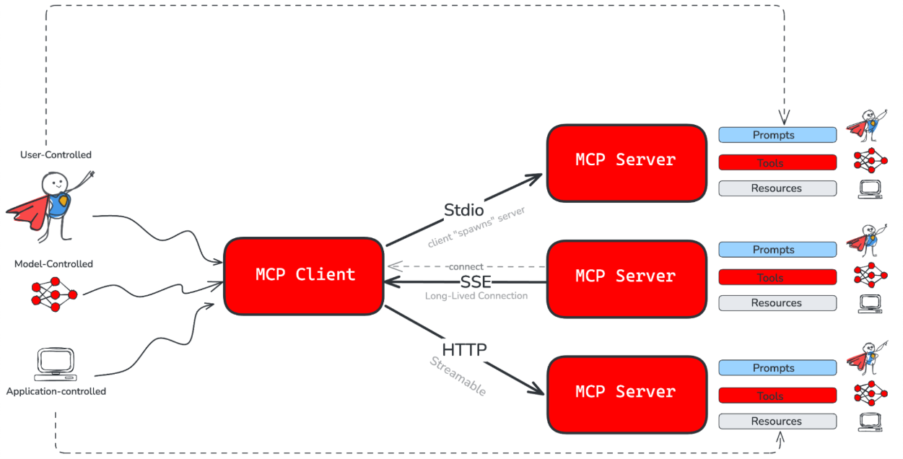
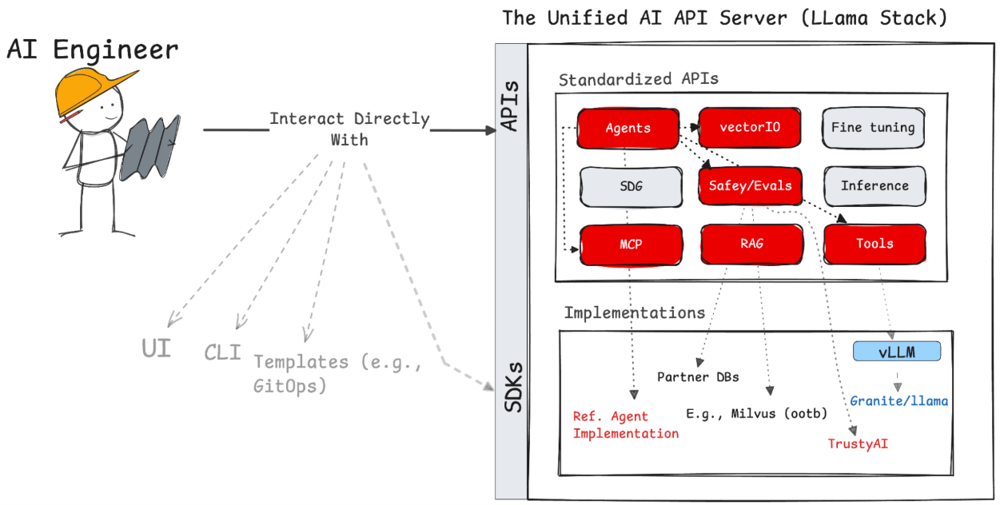
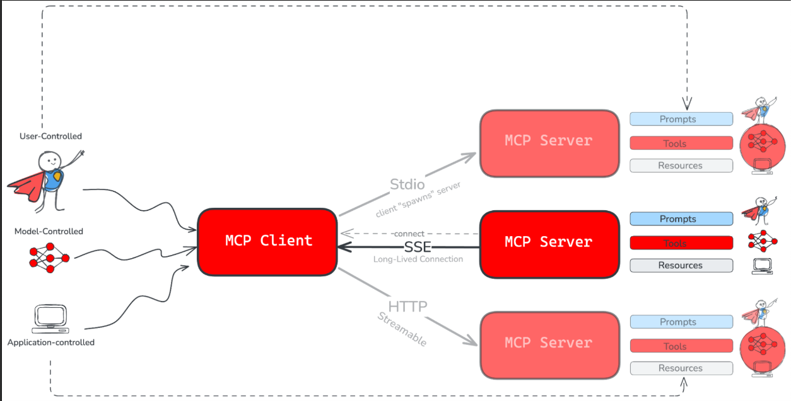
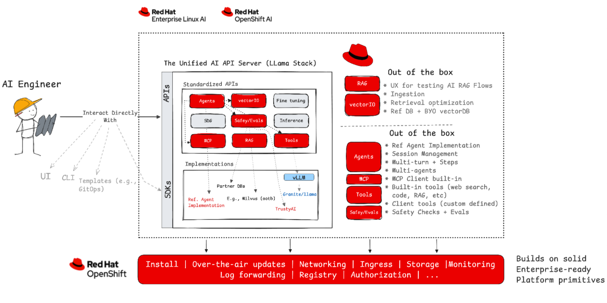

# RHOAI를 통해 기업용 AI 에이전트 구축

1. [AI 에이전트와 모델 컨텍스트 프로토콜](build_ai_agent_via_rhoai.md#1-ai-에이전트와-모델-컨텍스트-프로토콜)<br>
2. [AI 에이전트 개발을 위한 유연한 RHOAI](build_ai_agent_via_rhoai.md#2-ai-에이전트-개발을-위한-유연한-rhoai)<br>
3. [RHOAI 개발 경로 및 지원 옵션](build_ai_agent_via_rhoai.md#3-rhoai-개발-경로-및-지원-옵션)<br>
4. [Llama 스택을 탑재한 RHOAI](build_ai_agent_via_rhoai.md#4-llama-스택을-탑재한-rhoai)<br>

<br>
<br>

## 1. AI 에이전트와 모델 컨텍스트 프로토콜

### 1.1 AI 에이전트

AI 에이전트는 인공지능이 단순한 패턴 인식이나 텍스트 생성을 넘어 진화하고 있는 것을 보여 줍니다.

#### 1.1.1 AI 에이전트란

* 단순히 반응하는 것이 아니라, 주어진 환경 내에서 목표를 달성하기 위해 행동하도록 설계된 시스템
* 근본적으로 기본 모델과 증강(도구, 검색, 기억 등)을 결합하여 인식, 계획, 행동의 연속적인 루프를 형성
* `에이전트` = **모델** + **증강** + **루프**

#### 1.1.2 AI 에이전트와 현재의 생태계

* 이와 같은 조합(에이전트=모델+증강+루프)은 모델을 다양한 작업을 처리할 수 있는 역동적인 개체로 변화 시킴
* 그러나, 현재의 AI 생태계는 분산되어 있음
  + 에이전트를 구축하려면 서로 다른 도구, 프레임워크, 모델, 벡터 데이터베이스, 그리고 맞춤형 통합으로 이루어진 복잡한 미로를 헤쳐나가야 감
* NxM 문제 발생
  + N개의 모델을 M개의 도구와 통합하려면 N × M개의 맞춤형 솔루션/구현이 필요
  + 결과적으로 시스템은 복잡하고 확장이 어려우며 유지 관리가 어렵고 표준화가 부족
<br>

### 1.2 모델 컨텍스트 프로토콜(MCP: Model Context Protocol)

* 도구 로직을 반복적으로 재구축하는 번거로움을 피하는 것이 목적
* AI 클라이언트가 MCP 서버에 노출된 도구를 검색하고 사용할 수 있도록 하는 공통 언어를 제공
* "일대다" 상호작용 모델로의 전환은 모든 도구에 대한 맞춤형 연결을 구축하는 것보다 통합을 간소화
<br>

### 1.3 레드햇 AI와 Llama 스택/MCP와 통합



* 레드햇 AI 포트폴리오에 Llama 스택과 MCP 통합
* AI 모델, 도구 및 에이전트 AI에 필요한 기타 구성 요소를 사용하는 통합 플랫폼으로 레드햇 AI 확장
* LangGraph, LangChain, Crew AI 등의 기술을 통해 구축된 에이전트 배포에 대한 레드햇 AI의 기존 지원을 기반으로 구성
<br>
<br>

## 2. AI 에이전트 개발을 위한 유연한 RHOAI

### 2.1 유연할 플랫폼, RHOAI

도구 상호작용을 표준화하는 것이 도움이 되지만, 개발자는 여전히 이러한 AI 시스템을 구축, 교육, 배포 및 관리하도록 특별히 설계된 강력한 플랫폼이 필요합니다.

**레드햇 AI 포트폴리오의 일부인 RHOAI**
* 전체 AI 라이프사이클을 위한 엔터프라이즈급 플랫폼 역할
* AI 기반 애플리케이션, 모델, 그리고 가장 중요한 에이전트를 구축할 수 있도록 지원
* RHOAI는 다음과 같은 기능을 통해 유연성을 제공

#### 2.1.1 AI API 서버를 통한 간소화된 개발

**다재다능한 AI 시스템**
* Llama 스택을 AI API 서버로 통합
  + 특히 검색 증강 생성(RAG) 및 에이전트 로직을 포함하는 시스템의 개발을 가속화하고 구축을 간소화
* 통합은 턴키 방식의 추상화를 제공
  + AI 애플리케이션을 구축
  + 안전성, 평가, RAG 등 필요한 모든 AI 기본 요소를 패키징하고 노출

#### 2.1.2 핵심 구성 요소에 대한 직접 액세스

* 더욱 세부적인 제어가 필요한 팀을 위해 RHOAI는 강력한 기반 구성 요소에 대한 직접 액세스를 제공
* 예) 최적화된 vLLM 통합 및 모델 제공을 통해 현재 제공되는 고성능 추론 기능
  + 독립형 추론 엔진을 사용하고 원하는 에이전트 프레임워크와 통합
  + 효율적인 추론은 에이전트적 맥락에서 점점 더 중요해짐
  + 특히 추론(reasoning)과 계획(planning)은 모든 에이전트적 애플리케이션의 핵심
* 마찬가지로, Trusty AI를 통해 AI 가드레일을 포함한 맞춤형 안전 계층을 구축하는 데 고급 안전 기능을 사용
<br>

### 2.2 Llama 스택: RHOAI 상에 AI API 서버 통합

#### 2.2.1 오프시프트와 Llama 스택

**쿠버네티스와 API**
* 애플리케이션을 배포하려면 다양한 인프라, 커스텀 스크립트, 애드혹 구성 등을 해야 하는 어려움과 복잡함
* 쿠버네티스와 오픈시프트(쿠버네티스 배포판)는 표준화된 컨트롤-플레인을 도입하여 해결
  + 핵심 기본 요소(예: 포드, 배포)를 갖춘 API 서버와 커스텀 리소스 정의(CRD)를 통한 확장성을 제공
  + 이를 통해 인프라의 복잡성이 추상화되어 개발자는 배관 작업이 아닌 애플리케이션에 집중할 수 있음

**LLama 스택와 API**
* 오늘날 AI 시스템과 에이전트를 구축하는 작업은 워크로드를 조율할 때 쿠버네티스 사용 이전과 같음
  + 다양한 도구, 모델, 벡터 데이터베이스를 조각조각 모아 모든 것을 연결하는 "글루 코드"를 생성 필요
  + 복잡하고 단편화되어 있으며, 중요한 AI API 서버 추상화가 부족
* Llama 스택은 쿠버네티스 컨트롤-플레인와 같은 역할을 하는 AI 버전
  + Llama 스택은 AI 워크로드를 위해 특별히 설계된 통합 AI API 서버를 도입하여 복잡성을 해소

#### 2.2.2 Llama 스택은 통합된 AI API 서버

**Llama 스택이 기본적으로 제공하는 주요 기능**


|주요 기능|설명|
|:---:|:---|
|`표준 AI API`|<ul><li>Llama 스택은 핵심 AI 작업(추론, RAG, 에이전트, 안전성)에 대해 일관된 엔드포인트를 제공</li><li>각 AI 도구마다 다른 API를 배울 필요가 없음</li></ul>|
|`복잡성 추상화`|<ul><li>기본 AI 도구, 데이터베이스, 추론 엔진(예: vLLM), 그리고 MCP 클라이언트 기능 통합을 통해 MCP와 같은 프로토콜 간의 차이점을 숨김</li><li>이를 통해 AI 개발자는 코드의 상당 부분을 재작성하지 않고도 도구나 백엔드를 전환</li></ul>|
|`확장 가능한 설계`|<ul><li>공급자 모델은 쿠버네티스의 CRD 및 연산자와 유사한 표준 인터페이스를 통해 다양한 백엔드(예: 벡터 데이터베이스)를 플러그인할 수 있도록 지원</li><li>이러한 설계를 통해 동일한 API 기반으로 외부 기여가 가능</li></ul>|
|`에이전트 중심`|<ul><li>에이전트 개발에 필수적인 기본 개념(메모리, 도구, RAG)을 포함</li></ul>|
<br>

### 2.3 Llama 스택을 통한 도구 상호작용 간소화



```py
agent = Agent(
  client,
  model=model_id,
  instructions="""You are a helpful assistant with access to tools ...""",
  tools=["mcp::docling"]
)
```
* MCP와 같은 프로토콜을 사용
  + 도구 서버와의 연결 및 상호작용을 간소화
  + 클라이언트 기능을 API 계층에 직접 통합
* 이를 통해 개발자는 Llama 스택을 통해 도구를 사용할 때 하위 수준의 프로토콜 세부 정보로부터 보호 받음
<br>
<br>

## 3. RHOAI 개발 경로 및 지원 옵션

### 3.1 RHOAI 상에 AI 에이전트

**AI 에이전트 구축 전략**
* RHOAI는 Llama 스택이든 다른 에이전트 프레임워크든 AI 에이전트 구축을 위한 특정 전략을 지원
* Llama 스택 통합을 제공하는 동시에 이러한 구성 가능성을 제공함으로써 엔터프라이즈 지원을 바탕으로 유연성을 확보

**API 기반 아키텍처의 Llama 스택**
* Llama 스택은 API 기반 아키텍처를 통해 다양한 AI 작업에 대한 단일 통합 지점을 제공하여 AI 개발을 간소화
* 이러한 설계는 "공급자"를 통한 확장성을 제공하여 공급업체, 파트너 및 커뮤니티가 자체 Llama 스택 API 구현을 통합할 수 있도록 지원
* 에이전트 개발을 위해 Llama 스택에는 참조 구현과 강력한 API 기본 요소(도구 상호작용 API, MCP, RAG, 사후 학습 등)가 포함
<br>

### 3.2 에이전트를 구축하는 방법



#### 3.2.1 Llama 스택 및 RHOAI를 활용한 구축

* 레드햇에서 지원하는 제공업체/구현을 통해 RHOAI의 일부인 Llama 스택의 기본 기능을 활용하여 에이전트 구축
* 가장 효율적이고 완벽한 지원 환경
* 이러한 접근 방식은 개발을 간소화하고 레드햇의 기본 지원을 제공

#### 3.2.2 Llama Stack 및 RHOAI를 사용하는 BYO 제공업체

* RHOAI에 통합된 Llama 스택을 사용하여 에이전트를 생성하고, 자체 Llama 스택 호환 제공업체 구현도 활용
  + 예: 추론에 vLLM을 사용하는 대신 OpenAI 엔드포인트에 직접 연결
* 레드햇은 API 수준에서 지원을 제공
  + 선택한 제공업체 또는 구현에 대한 지원은 공급업체 또는 커뮤니티가 제공

#### 3.2.3 BYO 에이전트 프레임워크

* 추론(OpenAI 호환), 안전, 평가 등 Llama 스택 API를 선택적으로 사용하면서 자체 에이전트 프레임워크를 사용
* 레드햇은 사용자가 선택한 Llama 스택 API에 대한 지원을 제공

#### 3.2.4 핵심 기본 요소를 활용한 구축

* 오픈시프트 및 RHOAI 기본 요소 기반에서, 추론을 위한 자체 vLLM 및 에이전트 프레임워크는 가져와 표준 ​​워크로드 실행으로 구축
* 레드햇은 플랫폼과 기본 요소를 지원
  + 선택한 프레임워크에 대한 지원은 공급업체 또는 커뮤니티가 제공
<br>
<br>

## 4. Llama 스택을 탑재한 RHOAI

AI 에이전트가 등장했고, 이제 플랫폼이 필요합니다. 하지만 영향력 있는 에이전트를 구축하려면 단순히 도구를 연결하는 것 이상의 작업이 필요합니다. 강력하고 유연하며 엔터프라이즈급 기반이 필요합니다.

**AI API 서버로 Llama 스택을 탑재한 RHOAI**
* 오픈소스 코어
  + 오픈소스 정신에 기반한 이 플랫폼은 추론(vLLM/모델 서빙), 평가, 안전성(TrustyAI 기반), RAG, 에이전트에 대한 합리적인 기본 기능을 제공
  + Bring Your Own(BYO) 옵션을 통해 스택의 모든 계층을 맞춤 설정하고, 엄격한 구현 방식을 강요하지 않고도 상호 운용성을 위해 설계된 API 계약의 이점을 누림
* 진정한 하이브리드
  + 퍼블릭, 프라이빗 또는 엣지 환경에서 일관되게 배포하고 원활하게 관리
  + 벤더 종속을 피하고 기존 엔터프라이즈 인프라에 AI를 직접 통합
* 최상의 결과를 위한 모델 맞춤 설정
  + 최첨단 기술로 기술 구축, 지식 정제, 합성 데이터 생성
  + 이를 통해 단순한 미세 조정을 넘어, 내재된 모델 지식과 전문 기술 간의 적절한 균형을 달성
* 엔터프라이즈급 보안 및 책임감 있는 AI
  + 데이터 제어, 규정 준수, 책임감 있는 AI 원칙을 우선시하는 보안 중심 플랫폼
<br>
<br>

------
[차례](/README.md)