# 오픈시프트 상에서 Kubeflow Trainer를 사용하여 LLM Fine-Tuning

**목차**
1. [개요](fine-tune_llms_with_kubeflow_trainer_on_openshift.md#1-개요)<br>
2. [랩 환경 구성](fine-tune_llms_with_kubeflow_trainer_on_openshift.md#2-랩-환경-구성)<br>
3. [LLM Fine-Tuning](fine-tune_llms_with_kubeflow_trainer_on_openshift.md#3-llm-fine-tuning)<br>
4. [Fine-Tuning으로 훈련된 모델 테스트](fine-tune_llms_with_kubeflow_trainer_on_openshift.md#4-fine-tuning으로-훈련된-모델-테스트)<br>

## 1. 개요

### 1.1 LLM과 레드햇 오픈시프트 AI

대규모 언어 모델(LLM)은 여전히 ​​집중적인 연구 분야이며, 새로운 산업으로 빠르게 확산되고 있습니다. 여러 기업에서 매주 새로운 학술 논문과 업데이트된 오픈 모델이 발표되면서 기존 폐쇄형 소스 모델과의 격차를 줄이고 있습니다. 오픈 소스 커뮤니티 덕분에 인기 프로젝트에 새로운 모델과 혁신이 지속적으로 통합되어 도입 장벽을 낮추고 최첨단 기술을 따라잡는 데 필요한 마찰을 해소하고 있습니다.

하지만 심층 신경망(소프트웨어 2.0이라고도 함) 기반 애플리케이션은 모델을 학습하고 제공하기 위해 강력한 가속기를 필요로 하며, 인프라를 상호 연결하고 사용자에게 소프트웨어와 하드웨어 간의 호환성과 유연성을 보장하는 통합 플랫폼은 경쟁 우위를 확보하는 데 중요한 요소입니다.

레드햇 오픈시프트 AI는 PyTorch, Kubeflow, vLLM과 같은 오픈 소스 프로젝트를 오픈시프트 상에 구축합니다. 

**레드햇 오픈시프트 AI**
* 다양한 가속기를 지원
* Kueue와 같은 워크로드 오케스트레이션 도구를 활용
* 벤더-록인 최소화 / 활용도 극대화 / 투자 수익률(ROI)을 높임
* Kubeflow Training 오퍼레이터 & SDK
  + PyTorch 및 HuggingFace Transformers와 같은 인기 라이브러리를 사용
  + 오프시프트에서 모델을 훈련하는 데 Kubeflow를 사용 가능
  + [fms-hf-tuning](https://github.com/foundation-model-stack/fms-hf-tuning)과 같은 더욱 맞춤화된 라이브러리를 활용 가능

### 1.2 Kubeflow Trainer를 통한 LLM Fine-Tuning

* Kubeflow Training 오퍼레이터 및 SDK 사용
  + SFTTrainer (Hugging Face Supervised Fine-tuning Trainer)
  + LoRA/QLoRA
  + PyTorch FSDP (Fully Sharding Data Parallel)

* 최적화
  + FlashAttention 및 Liger Kernel를 통한 최적화/융합 커널를 통한 메모리 소비 개선
  + 효율적인 GPU P2P 통신
<br>
<br>

## 2. 랩 환경 구성

### 2.1 시스템 구성

#### 2.1.1 플랫폼 구성

* 오픈시프트 4.14+
* 오픈시프트 AI 오퍼레이터 2.19+
  + 대시보드
  + 워크벤치
  + 훈련 오퍼레이터
  + 기타 등등 활성화
* 워커 노드 상에 GPU
  + NVidia GPU (Ampere 이상의 GPU)
  + AMD 가속기 (Instinct MI300X 이상의 가속기)
* Node Feature Discovery 오퍼레이터
* GPU 오퍼레이터
  + NVidia GPU 오퍼레이터 ([ClusterPolicy](https://docs.nvidia.com/datacenter/cloud-native/openshift/latest/install-gpu-ocp.html#create-the-clusterpolicy-instance) 리소스 설정)
  + AMD GPU 오퍼레이터 ([구성 방법](https://instinct.docs.amd.com/projects/gpu-operator/en/latest/installation/openshift-olm.html#configuration))
* 스토리지 클래스 제공
  + 동적 프로비저닝을 제공하는 PVC
  + RWX (ReadWriteMany) 액세스 모드
  + 예
    - 오픈시프트 데이터 파운데이션 (ODF)
    - [NFS 동적 프로비저너](https://github.com/opendatahub-io/distributed-workloads/tree/main/workshops/llm-fine-tuning#nfs-provisioner-optional)

#### 2.2.2 AI 

* 예제 리포지토리: [LLM fine-tuning w/ Kubeflow Training on OpenShift AI](https://github.com/opendatahub-io/distributed-workloads.git)
* 사전 훈련된 AI 모델: [Llama 3.1 8B Instruct](https://huggingface.co/meta-llama/Llama-3.1-8B-Instruct)
* 데이터 셋: 허깅페이스의 [GSM8K](https://huggingface.co/datasets/openai/gsm8k)

<br>

### 2.2 워크벤치 생성

#### 2.2.1 RHOAI 대시보드에 로그인

오픈시프트 웹 콘솔 상단에서 RHOAI 대시보드에 액세스
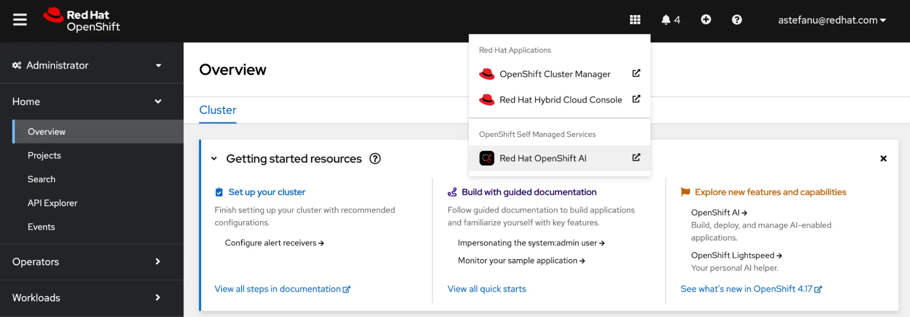

* 지정한 사용자 로그인 정보를 이용

#### 2.2.2 데이터 사이언스 프로젝트 생성

왼쪽 메뉴에서 **Data Science Projects** 선택 후 **Create project**를 클릭
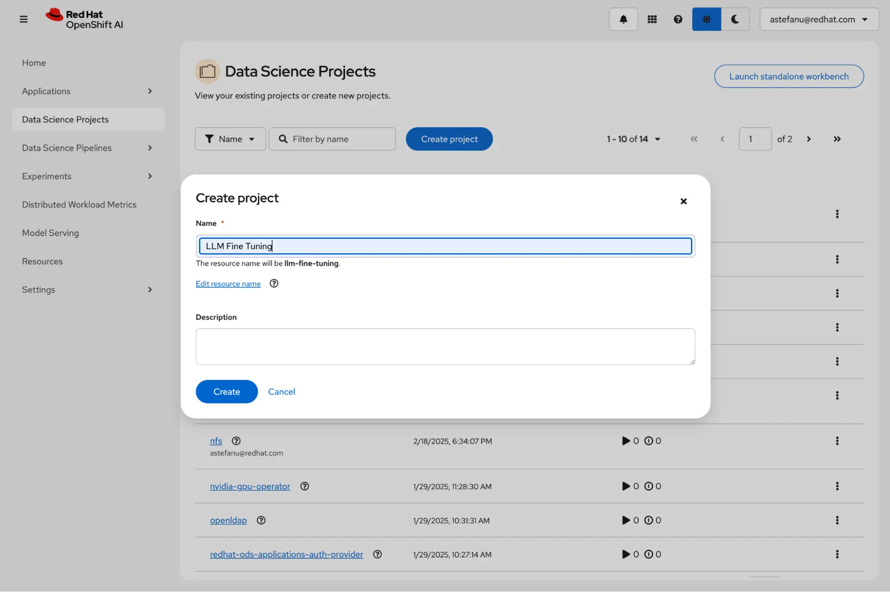

* 프로젝트 이름 (예: `LLM Fine Tuning`) 입력 후 **Create**를 클릭

#### 2.2.3 워크벤치 생성

생성된 프로젝트 `LLM Fine Tuning`에서 **Create a workbench**를 클릭
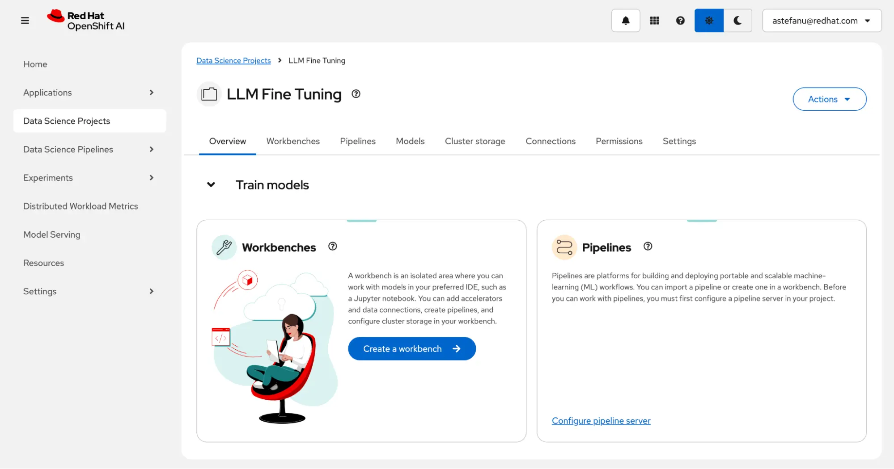
<br>

### 2.3 워크벤치 설정

#### 2.3.1 이름 및 노트북 이미지 설정

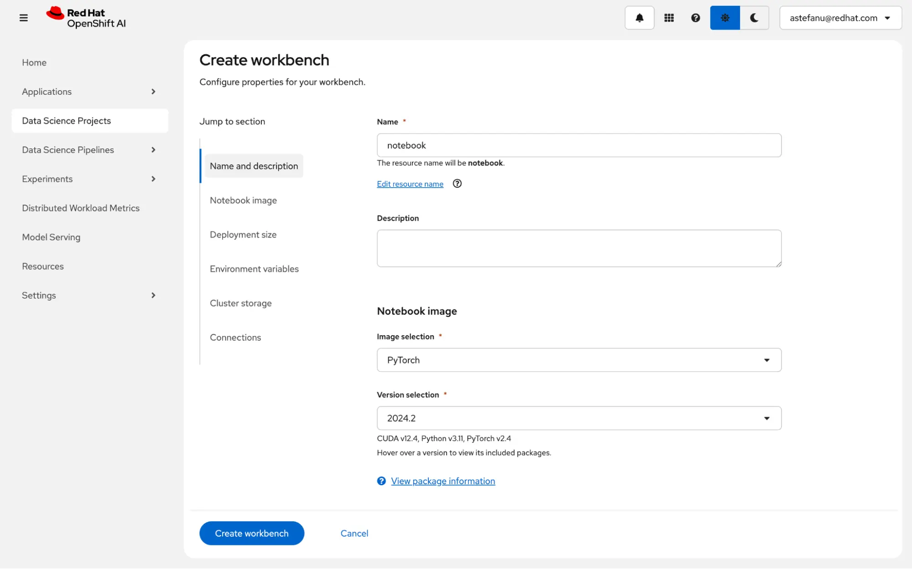

* *Name and description* 섹션
  + 이름: `notebook`
* *Notebook image* 섹션
  + 이미지: `PyTorch` (NVidia GPU) 또는 `ROCm-PyTorch` (AMD 가속기) 
  + 버전: 기본값 사용

#### 2.3.2 컨테이너 크기 및 가속기 설정

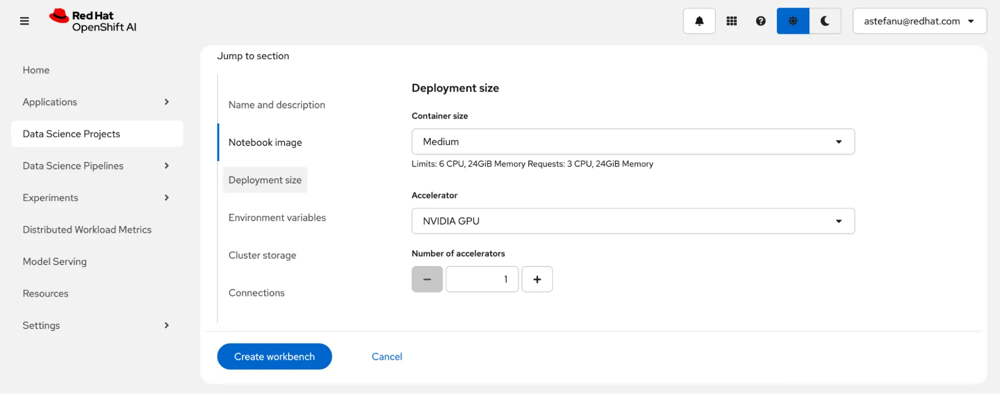

* *Deployment size* 섹션
  + 컨테이너 크기: `Medium`
  + 가속기: NVidia GPU (혹은 AMD)

#### 2.3.3 스토리지 설정

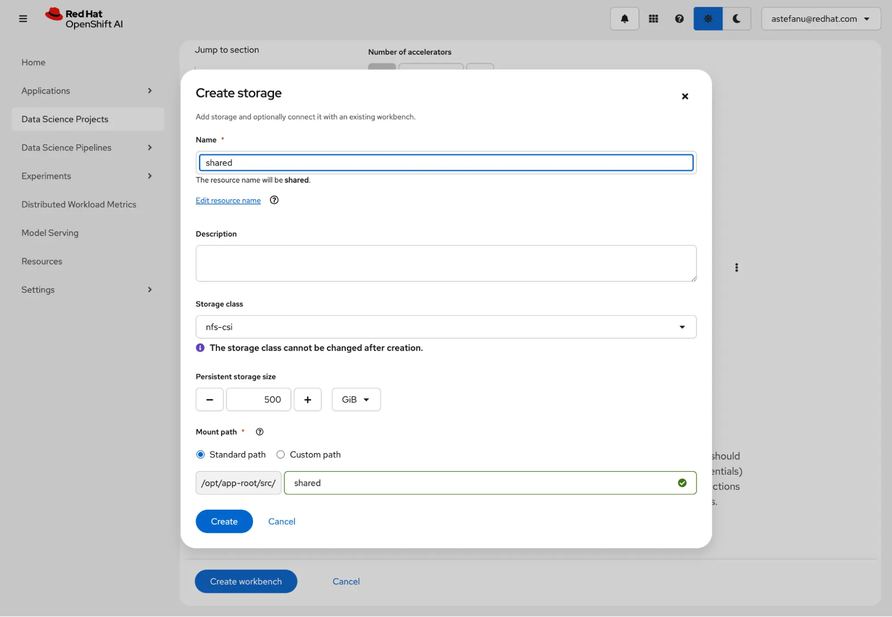

* *Cluster storage* 섹션
  + 스토리지 생성
    - 이름: `shared`
    - 스토리지 클래스: `nfs-csi` (예: 동적 프로비저너로 구성된 NFS 스토리지 클래스)
    - 크기: `500` GiB
    - 마운트 경로: *Standard path* (`/opt/app-root/src/shared`)
* 해당 스토리지는 워크벤치인 `notebook`과 Finin-Tuning 작업사이에서 모델 체크포인트를 유지하기 위한 공유 저장소
  + 이를 위해 RWX가 제공되는 스토리지 클래스에서 생성

#### 2.3.4 설정 리뷰후 워크벤치 생성

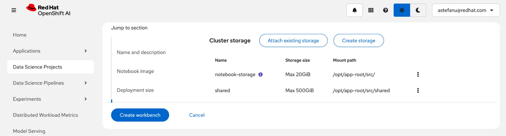

* 클러스터 스토리지 설정을 리뷰
* **Create workbench**를 클릭
<br>

### 2.4 프로젝트 `LLM Fine Tuning`의 **워크벤치** 탭에서 `notebook` 상태 확인

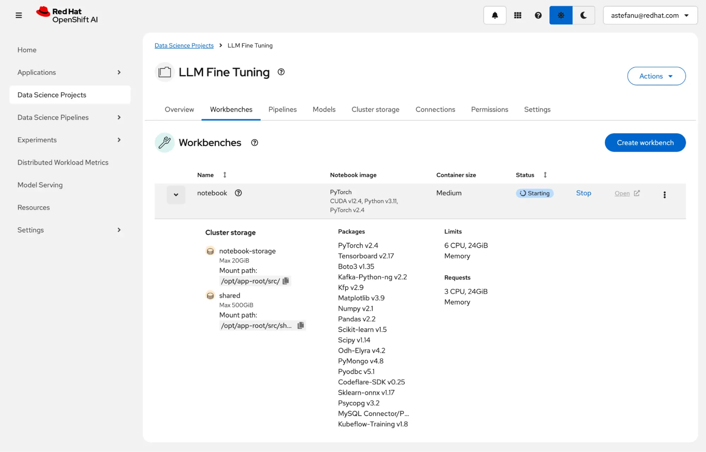

* 워크벤치가 준비되면 **Open**을 클릭
<br>
<br>

## 3. LLM Fine-Tuning

### 3.1 LLM Fine-Tuning 노트북 예제 준비

#### 3.1.1 Git에서 예제를 복제

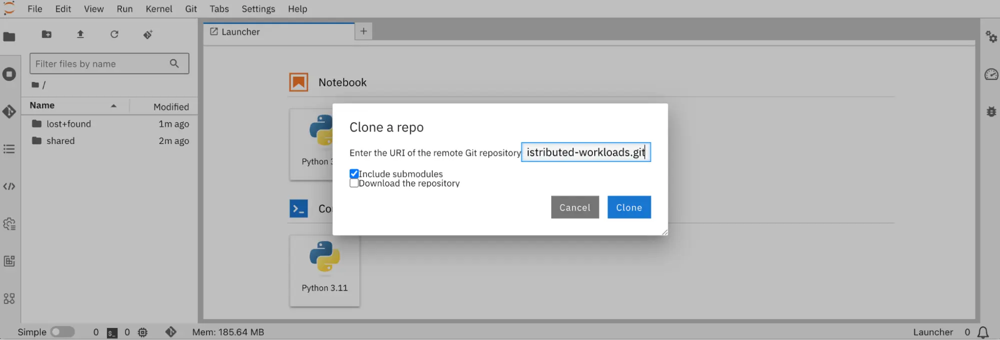

1. 노트북의 왼쪽 메뉴의 Git 아이콘을 클릭
2. 아래 URL을 입력
   ```
   https://github.com/opendatahub-io/distributed-workloads.git
   ```
3. **Clone**을 클릭하여 Git의 리포지토리를 복제

#### 3.1.2 [`sft.ipynb`](https://github.com/opendatahub-io/distributed-workloads/blob/main/examples/kfto-sft-llm/sft.ipynb) 노트북 오픈

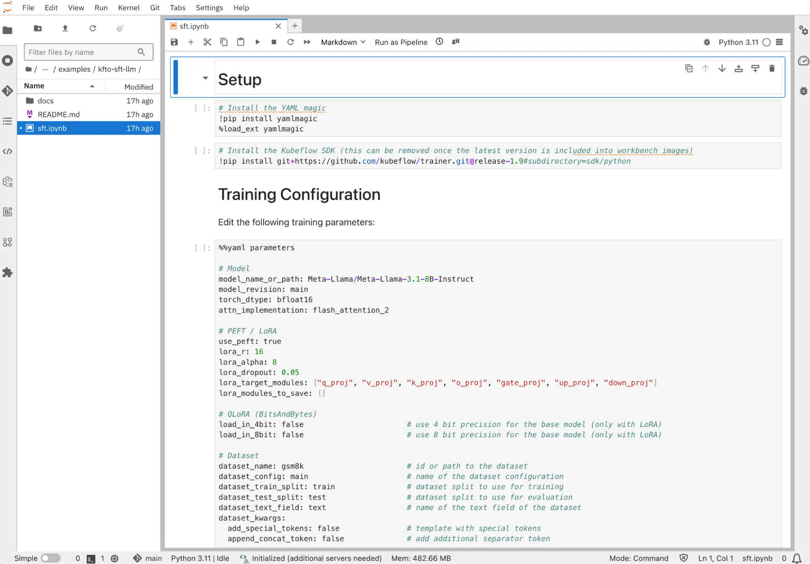

1. 네비게이션 창에서 `distributed-workloads/examples/kfto-sft-llm` 디렉터리로 이동
2. 파일 `sft.ipynb`을 클릭
<br>

### 3.2 Fine-Tuning 작업 구성

#### 3.2.1 [`sft.ipynb`](https://github.com/opendatahub-io/distributed-workloads/blob/main/examples/kfto-sft-llm/sft.ipynb)의 모델 및 데이터셋 구성

```yaml
# Model
model_name_or_path: Meta-Llama/Meta-Llama-3.1-8B-Instruct
model_revision: main
# Dataset
dataset_name: gsm8k                       # id or path to the dataset
dataset_config: main                      # name of the dataset configuration
```

#### 3.2.2 [`sft.ipynb`](https://github.com/opendatahub-io/distributed-workloads/blob/main/examples/kfto-sft-llm/sft.ipynb)의 PEFT 및 LoRA 구성

```yaml
# PEFT / LoRA
lora_r: 16
lora_alpha: 8
lora_dropout: 0.05
lora_target_modules: ["q_proj", "v_proj", "k_proj", "o_proj", "gate_proj", "up_proj", "down_proj"]
```

> [!NOTE]
> PEFT는 Parameter-Efficient Fine-Tuning의 약자입니다.

> [!NOTE]
> **LoRA**
> * 전체 미세 조정에 비해 학습되는 매개변수 수를 대폭 줄임
> * 비슷한 성능을 유지
> * 제한된 컴퓨팅 리소스를 수용할 수 있는 유연성을 제공
> * 사용 예
>   + 사전 훈련된 모델인 Llama 3.1 8B Instruct는 8,072,204,288개의 매개변수 사용
>   + 기본 LoRA 매개변수를 사용하면 41,943,000개만으로 훈련 가능한 매개변수가 생성
>   + 이는 모델 매개변수 대비 0.5196%

> [!NOTE]
> **[Catastrophic Forgetting](https://en.wikipedia.org/wiki/Catastrophic_interference)**
> * 추가된 LoRA 어댑터 가중치만 학습되고 사전 학습된 모델의 원래 가중치는 변경되지 않음
> * 모델이 사전 훈련 중에, 훈련한 지식이 다른 데이터셋에서 미세 조정된 후에도 "***잊혀지지***" 않도록 유지

#### 3.2.3 [`sft.ipynb`](https://github.com/opendatahub-io/distributed-workloads/blob/main/examples/kfto-sft-llm/sft.ipynb)의 모델 훈련 하이퍼-패러미터 및 가속기 리소스 설정

```yaml
attn_implementation: flash_attention_2    # one of eager, sdpa or flash_attention_2
use_liger: false                          # use Liger kernels
per_device_train_batch_size: 32           # batch size per device during training
per_device_eval_batch_size: 32            # batch size for evaluation
bf16: true                                # use bf16 16-bit (mixed) precision
tf32: false                               # use tf32 precision
```
* 패러미터 중 일부는 사용 환경에 따라 제한이 있을 수 있음
  + 구형 가속기는 *bfloat16*/*tfloat32*와 같은 부동 소수점 정밀도 형식은 지원 안할 수 있음
  + *FlashAttention-2*는 *fp16* / *bf16* 데이터 유형만 지원
  + Liger 커널는 [일부 모델](https://github.com/linkedin/Liger-Kernel?tab=readme-ov-file#high-level-apis)에서만 사용 가능

#### 3.2.5 [`sft.ipynb`](https://github.com/opendatahub-io/distributed-workloads/blob/main/examples/kfto-sft-llm/sft.ipynb)의 체크포인트 및 로깅 구성

```yaml
# Checkpointing
save_strategy: epoch                      # save checkpoint every epoch
save_total_limit: 1                       # limit the total amount of checkpoints
# Logging
log_level: warning                        # logging level (see transformers.logging)
logging_strategy: steps
logging_steps: 1                          # log every N steps
report_to:
- tensorboard                             # report metrics to tensorboard
output_dir: /mnt/shared/Meta-Llama-3.1-8B-Instruct
```
<br>

### 3.3 데이터셋 준비

#### 3.3.1 SFT (Supervised Fine-Tuning)을 위한 데이터셋

**도메인 지식 및 토큰화**
* 선택한 사전 훈련된 모델에 통합해야 하는 도메인 지식을 제공
* 데이터셋 항목 토큰화
  + 훈련 중에 모델에 입력으로 전달될 수 있도록 특정 형식으로 구성됨

#### 3.3.2 허깅페이스 Transformers 라이브러리

* 다중 턴 대화 템플릿 스타일을 위한 *ChatML* 구조 지원
  + 데이터 세트 구조화 형식
    ```py
    [{"role": str, "content": str}]
    ```

* 프롬프트 완성 템플릿 스타일을 위한 *Instruction* 구조 지원
  + 데이터 세트 구조화 형식
    ```py
    [{"prompt": str, "completion": str}]
    ```

#### 3.3.3 데이터셋 변환 및 준비

[GSM8K](https://huggingface.co/datasets/openai/gsm8k) 데이터셋처럼 지정된 구조화된 형식을 따르지 않는 경우 변환이 필요

**template_dataset() 함수**
```py
# Templatize dataset
def template_dataset(sample):
    messages = [
        {"role": "user", "content": sample['question']},
        {"role": "assistant", "content": sample['answer']},
    ]
return {"text": tokenizer.apply_chat_template(messages, tokenize=False)}
```
* GSM8K 데이터셋의 *question* & *answer*를 *ChatML* 구조 형식으로 변환

#### 3.3.4 채팅 템플릿 준비

데이터세트가 준비되면 [chat template](https://huggingface.co/docs/transformers/main/en/chat_templating#template-selection)을 선택
* 기본적으로 사전 학습된 모델 토크나이저의 구성 파일에서 지정한 템플릿 사용
  + *`tokenizer_config.json`* 파일의 *chat_template* 필드
  + 일반적으로 Llama 3.1 8B Instruct와 같은 명령어 튜닝 모델에 사용
* 또는 직접 템플릿을 제공

**템플릿 제공 예**
```py
# Chat template
# Anthropic/Vicuna like template without the need for special tokens
LLAMA_3_CHAT_TEMPLATE = (
    ""
    ""
    "{{ message['content'] }}"
    ""
    "{{ '\n\nHuman: ' + message['content'] +  eos_token }}"
    ""
    "{{ '\n\nAssistant: '  + message['content'] +  eos_token  }}"
    ""
    ""
    ""
    "{{ '\n\nAssistant: ' }}"
    ""
)
tokenizer.chat_template = LLAMA_3_CHAT_TEMPLATE
```
<br>

### 3.4 클라이언트 SDK 구성

#### 3.4.1 **PyTorchJob** 리소스

* Kubeflow 훈련 SDK를 사용하여 Kubeflow Trainer 오퍼레이터가 PyTorch 포드 구성
* 포드 생성을 위한 권한 필요
  + SDK가 오픈시프트 API 서버에 인증
  + 해당 PyTorchJob 리소스를 생성할 권한을 부여 받음
  + 이를 위한 유효한 베어러 토큰을 제공

#### 3.4.2 노트북에서 인증 및 권한을 위한 구성

```py
api_server = "<API_SERVER>"
token = "<TOKEN>"
# Un-comment if your cluster API server uses a self-signed certificate or an un-trusted CA
#configuration.verify_ssl = False
```
1. 오픈시프트 콘솔의 오른쪽 상단의 드롭다운 메뉴
2. **로그인 명령 복사**를 선택
3. 베어러 토근 및 API URL 정보 확인
<br>

### 3.5 Fine-Tuning 작업 생성

#### 3.5.1 NViaid 기반 클라이언트 작업 생성 

```py
client.create_job(
    job_kind="PyTorchJob",
    name="sft",
    train_func=main,
    num_workers=8,
    num_procs_per_worker="1",
    resources_per_worker={
        "nvidia.com/gpu": 1,
        "memory": "64Gi",
        "cpu": 4,
    },
    base_image="quay.io/modh/training:py311-cuda121-torch241",
    env_vars={
        # HuggingFace
        "HF_HOME": "/mnt/shared/.cache",
        "HF_TOKEN": "",
        # CUDA
        "PYTORCH_CUDA_ALLOC_CONF": "expandable_segments:True",
        # NCCL / RCCL
        "NCCL_DEBUG": "INFO",
    },
    parameters=parameters,
    volumes=[
        V1Volume(name="shared",
       persistent_volume_claim=V1PersistentVolumeClaimVolumeSource(claim_name="shared")),
    ],
    volume_mounts=[
        V1VolumeMount(name="shared", mount_path="/mnt/shared"),
    ],
)
```
* 필요에 따라 환경 변수의 ***HF_TOKEN***에 허깅페이스의 유효한 사용자 액세스 토큰 입력
* 리소스에 따라 워커 노드의 리소스 설정 변경

#### 3.5.2 AMD 기반 클라이언트 작업 생성

추가적으로 필드 업데이트
```py
client.create_job(
    resources_per_worker={
        "amd.com/gpu": 1,
    },
    base_image="quay.io/modh/training:py311-rocm62-torch241",
    env_vars={
        # ROCm (HIP)
        "PYTORCH_CUDA_ALLOC_CONF": "expandable_segments:True",
    },
)
```

#### 3.5.3 클라이언트 작업 설정

**훈련을 위한 컨테이너 이미지**
* 레드햇 오픈시프트 AI를 지원하는 구성](https://access.redhat.com/articles/rhoai-supported-configs)에서 훈련에 사용할 수 있는 기본 컨테이너 이미지 목록 확인

**`HF_HOME` 한경 변수**
* 공유 영구 저장소를 가리키도록 구성
  + 허깅페이스에서 사전 훈련된 모델이 한 번 다운로드되어 캐시 디렉터리에 저장
  + 처음 한 명의 워커만 공유 파일 기반 잠금을 획득하여 모델을 다운로드
  + 다른 워커들은 다운로드가 완료될 때까지 기다림
* 이후 Fine-Tuning 작업 실행 시에는 모델을 다시 다운로드하는 대신 캐시에 저장된 체크포인트를 사용
  + 다양한 하이퍼파라미터를 실험하는 프로세스를 단축

#### 3.5.4 작업 모니터링

작업이 생성되면 해당 작업의 진행 사항을 모니터링할 수 있는 로깅 생성

```py
client.get_job_logs(
    name="sft",
    job_kind="PyTorchJob",
    follow=True,
)
```
<br>

### 3.6 모델 훈련 모니터링

#### 3.6.1 노트북에서 [TensorBoard](https://www.tensorflow.org/tensorboard/tensorboard_in_notebooks) 시작

실행 명령어
```bash
tensorboard --logdir /opt/app-root/src/shared
```

실행 결과
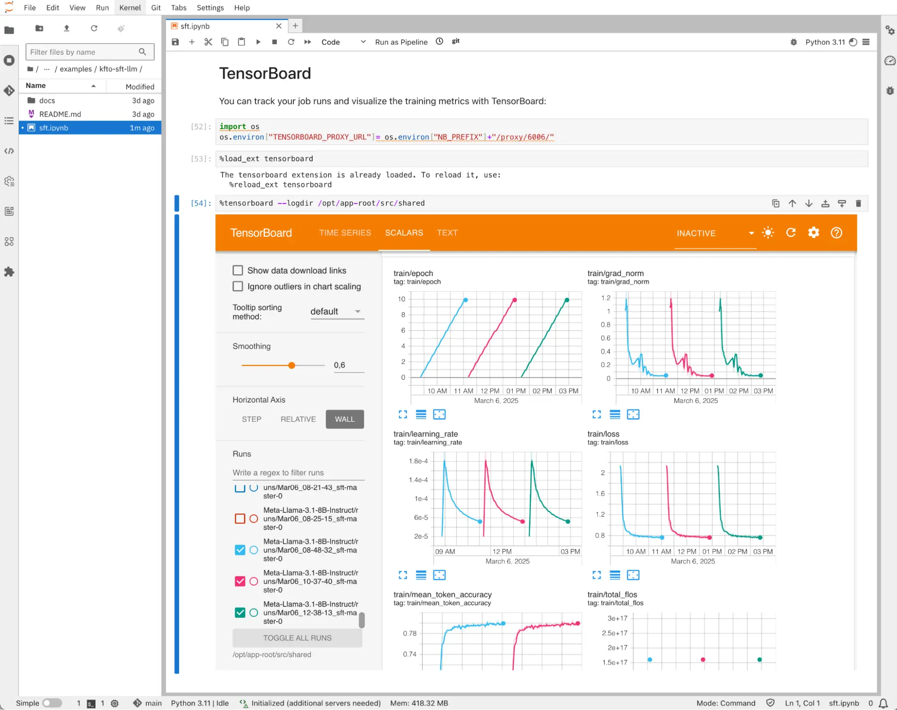

#### 3.6.2 모델 훈련 성능 지표

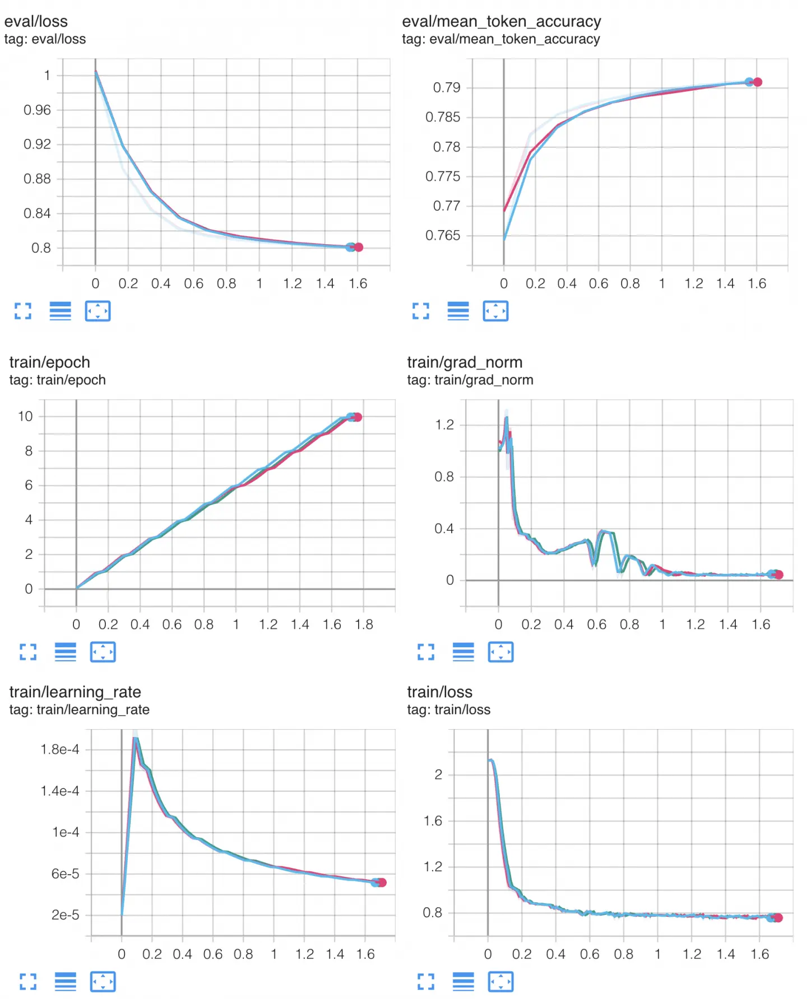

* 테스트 환경
  + 모델: Llama 3.1 8B Instruct
  + 데이터셋: GSM8K
  + GPU: NVidia A100/80 * 8장
* 모델 훈련 설정
  + 기본 attention인 *eager* 구성
  + FlashAttention 및 Liger 커널 활성화 구성
  + 다른 모든 하이퍼-패러미터는 같은 값으로 유지
* 테스트 결과
  + FlashAttention과 Liger Kernel이 수치적으로 정확하며 계산 과정에서 어떠한 근사치도 도입하지 않음을 보여줌
  + 그러나 예상된 속도 향상을 보여주지는 않음

> [!IMPORTANT]
> 속도 향상이 없다는 사실은 컴퓨팅에 제약되는 것이 아닌 다른 곳에 병목 현상이 있음을 나타냅니다.
> <br>
> PyTorch Fully Sharded Data Parallel(FSDP)은 모델 매개변수를 여러 GPU에 분산하여 학습을 분산합니다. 그러나 샤딩은 계산을 수행하기 위해 GPU 간에 상당한 통신 오버헤드를 유발합니다. 예를 들어, 모든 계층의 순방향 및 역방향 패스(더 정확하게는 계층 단위) 전에 모든 GPU에 샤딩된 가중치가 수집되고, 모든 미니 배치가 끝날 때 로컬 그래디언트가 감소 및 분산됩니다.
> <br>
> 모델의 크기와 GPU 수에 따라 이는 최대 트래픽이 수 Gbps에 달할 수 있음을 나타냅니다.

#### 3.6.3 모델 훈련 별 메모리 사용량

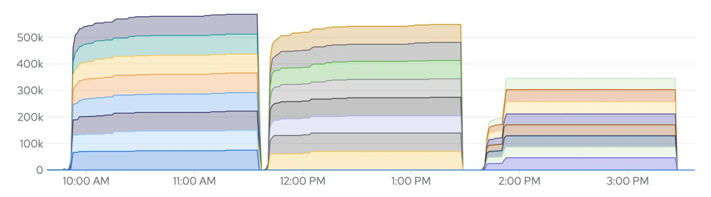

* 메트릭: DCGM_FI_DEV_FB_USED
  + 사용 가능한 프레임버퍼(Frame Buffer) 메모리 용량과 현재 사용 중인 프레임버퍼 메모리 용량
  + 단위는 MiB
* 테스트 결과
  + 좌측: *eager* attention
  + 중앙: *FlashAttention* (FA) → ***10***% 메모리 사용량 감소
  + 우측: FA + Liger 커널 → ***50***% 가까이 메모리 사용량 감소

#### 3.6.4 모델 훈련 중 네트워크 사용량

오픈시프트 콘솔의 **모니터링** → **대시보드** → **쿠버네티스** → **네트워크**에서 확인

**워커 노드 8대 사이의 수신 트래픽**
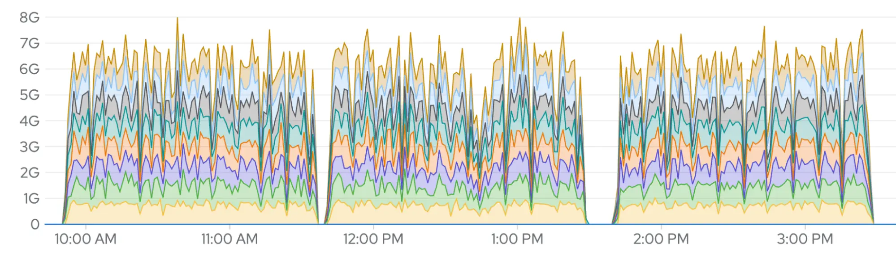
<br>

**워커 노드 8대 사이의 송신 트래픽**
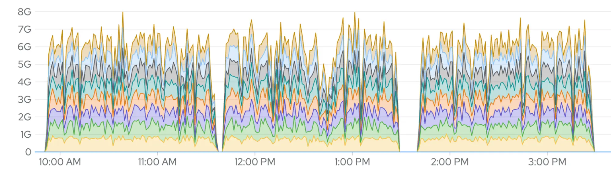

**분산 모델 훈련을 위한 네트워크**
* 표준 환경에서는 이러한 양의 데이터가 호스트 OVN 네트워크를 통해 전송
  + OVN은 이러한 사용 사례에 맞게 설계되지 않았기 때문에 처리 속도가 크게 느려져 병목 현상이 발생
  + 이는 다른 성능 향상을 방해
* 오픈시프트 AI의 NVIDIA GPUDirect RDMA은 이러한 병목 현상 해결을 위한 솔수션
<br>
<br>

## 4. Fine-Tuning으로 훈련된 모델 테스트

### 4.1 Fine-Tuning 된 모델 테스트

**가속기가 연결된 노트북에서 추론 모델 서비스 실행**
```py
# Load the pre-trained model
pretrained_path = "/opt/app-root/src/shared/.cache/hub/models--Meta-Llama--Meta-Llama-3.1-8B-Instruct/snapshots/0e9e39f249a16976918f6564b8830bc894c89659/"
base_model = AutoModelForCausalLM.from_pretrained(
    pretrained_path,
    local_files_only=True,
    torch_dtype=torch.bfloat16,
).to("cuda")
# Test the pre-trained model
pipeline = transformers.pipeline(
    "text-generation",
    model=base_model,
    tokenizer=tokenizer,
    model_kwargs={"torch_dtype": torch.bfloat16},
    device_map="auto",
)
messages = [
    {
        "role": "user",
        "content": "Janet's ducks lay 16 eggs per day. She eats three for breakfast every morning and bakes muffins for her friends every day with four. She sells the remainder at the farmers' market daily for $2 per fresh duck egg. How much in dollars does she make every day at the farmers' market?",
    }
]
outputs = pipeline(messages, max_new_tokens=256, temperature = 0.01)
output = ""
for turn in outputs:
    for item in turn["generated_text"]:
        output += f"# {item['role']}\n\n{item['content']}\n\n"
display(Markdown(output))
```

### 4.2 LoRA 어댑터와 함께 모델 테스트

**LoRA 어댑터와 병합하여 추론 모델 서비스 실행**
```py
# Merge the fine-tuned adapters into the base model 
finetuned_path = "/opt/app-root/src/shared/Meta-Llama-3.1-8B-Instruct/checkpoint-300/"
model = PeftModel.from_pretrained(base_model, finetuned_path)
model = model.merge_and_unload()
```
<br>
<br>

------
[차례](../README.md)