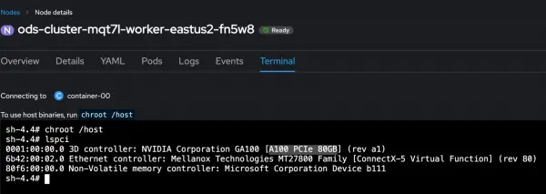
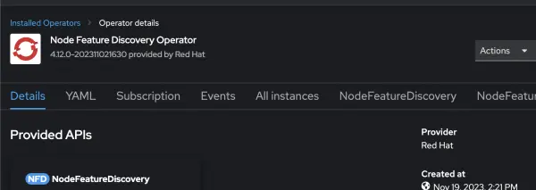
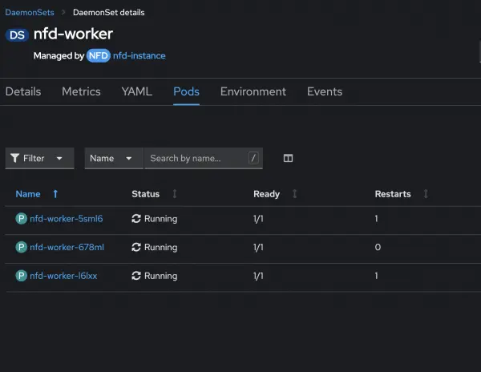
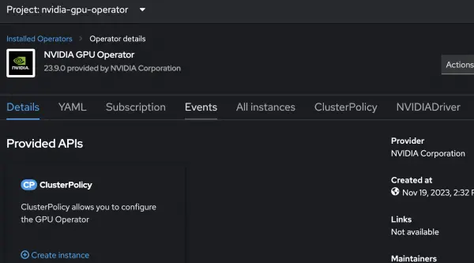
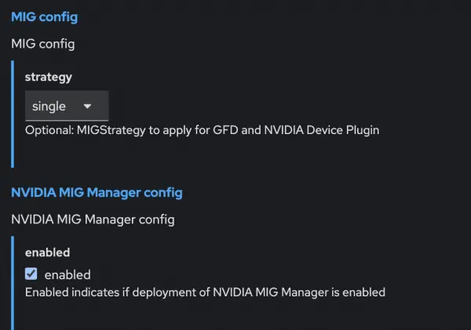
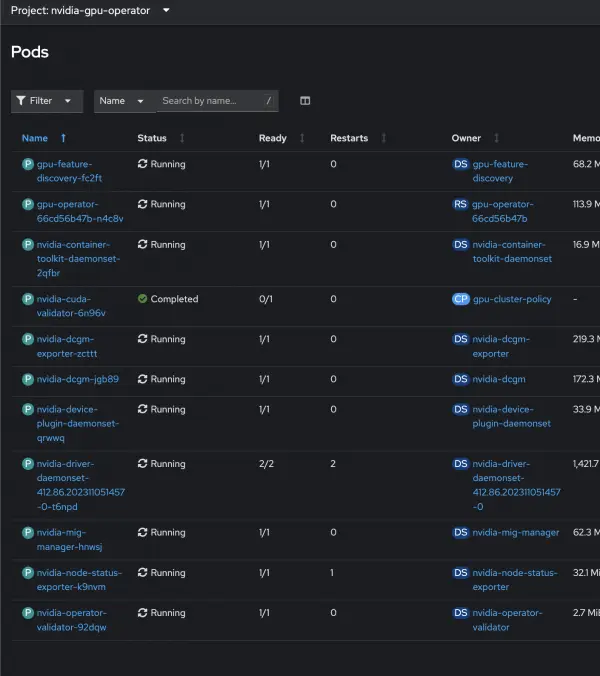
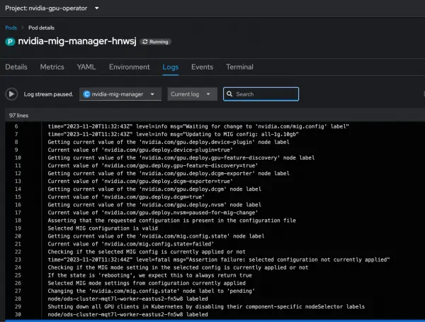
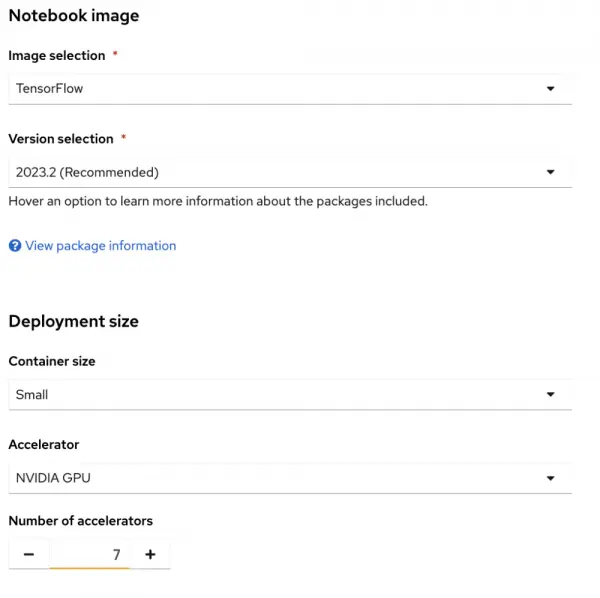

# 오픈시프트 AI 상에 MIG를 통한 GPU 효율 최대화

**목차**
1. [GPU 공유를 통한 효율 최대화](mig_maximizes_gpu_efficiency_on_openshift_ai.md#1-gpu-공유를-통한-효율-최대화)<br>
2. [MIG 테스트 환경 준비](mig_maximizes_gpu_efficiency_on_openshift_ai.md#2-mig-테스트-환경-준비)<br>
3. [MIG 인스턴스 생성 및 활용](mig_maximizes_gpu_efficiency_on_openshift_ai.md#3-mig-인스턴스-생성-및-활용)<br>
4. [결론](mig_maximizes_gpu_efficiency_on_openshift_ai.md#4-결론)<br>

<br>
<br>

## 1. GPU 공유를 통한 효율 최대화

### 1.1 데이터 사이언스 워크로드를 위한 GPU

최신 데이터 사이언스 워크로드는 높은 연산 능력을 요구하며, 그래픽 처리 장치(GPU)는 이러한 작업의 핵심 역할을 하는 경우가 많습니다. 그러나 여러 사용자 또는 워크로드 간에 GPU 리소스를 효율적으로 공유하는 것은 어려울 수 있습니다. NVIDIA 멀티 인스턴스 GPU(MIG) 기술이 해결책을 제시합니다. 
<br>

### 1.2 NVidia MIG

**쿠버네티스 환경에서 GPU는 기본적으로 1:1 비율로 포드에 할당**
* 즉, 워크로드가 GPU 용량을 완전히 활용하는지 여부와 관계없이 하나의 GPU가 하나의 포드에 할당
* 이러한 제한은 특히 소규모 워크로드의 경우 리소스 사용의 비효율성을 초래할 수 있음

**NVIDIA MIG**
* 단일 GPU를 여러 개의 독립 인스턴스로 분할하여 여러 포드에서 사용할 수 있도록 함으로써 이 문제를 해결
* 이 기능은 GPU 활용도를 극대화하고 리소스 낭비를 방지
<br>
<br>

## 2. MIG 테스트 환경 준비

### 2.1 테스트 시스템



* Azure 상에 *Standard_NC24ads_A100_v4 가상머신
* NVidia A100 PCIe 80GiB GPU를 갖춘 오픈시프트 AI
<br>

### 2.2 NFD 설치

#### 2.3.1 NFD (Node Feature Discovery)오퍼레이터 설치



#### 2.3.2 NFD가 데몬셋으로 각 노드에 정상적으로 실행 되는 지 확인



#### 2.3.3 NFD가 찾은 GPU 정보 확인

실행 명령어
```bash
oc describe node/ods-cluster-mqt7l-worker-eastus2-fn5w8
```

실행 결과
```
$ oc describe node/ods-cluster-mqt7l-worker-eastus2-fn5w8
                        Labels:           beta.kubernetes.io/arch=amd64
                                          feature.node.kubernetes.io/cpu-cpuid.ADX=true
                                          feature.node.kubernetes.io/cpu-cpuid.AESNI=true
                                          ...<snip>...
                                          feature.node.kubernetes.io/cpu-cpuid.FMA3=true
                                          feature.node.kubernetes.io/gpu.present=true
                                          feature.node.kubernetes.io/gpu.memory=80GB
                                          feature.node.kubernetes.io/gpu.vendor=nvidia
                                          feature.node.kubernetes.io/gpu.model=A100
$                                          
```
* GPU 벤더, 모델, 메모리 등 확인 가능
<br>

### 2.3 NVidia GPU 오퍼레이터 구성

#### 2.3.1 NVidia GPU 오퍼레이터 설치



#### 2.3.2 **ClusterPolicy** 구성에서 *MIG Manager*가 활성화된 것을 확인



<br>

### 2.4 포드 확인

#### 2.4.1 네임스페이스 *nvidia-gpu-operator*에서 모든 포드가 정상적으로 실행 중인지 확인

실행 명령어
```bash
oc get pods -n nvidia-gpu-operator
```

#### 2.4.2 오픈시프트 콘솔에서도 확인 가능



<br>
<br>

## 3. MIG 인스턴스 생성 및 활용

### 3.1 GPU 별 MIG 지원 프로파일 확인

#### 3.1.1 NVidia A100-80GiB 지원 구성 확인 

실행 명령어
```bash
oc describe configmap/default-mig-parted-config
```
* 명령 실행 결과에서 사용 가능한 구성을 확인 후, 요구 사항에 맞는 구성 선택

#### 3.1.2 예를 들어 1g.10gb * 7ea로 분할

```
# H100-80GB, H800-80GB, A100-80GB, A800-80GB, A100-40GB, A800-40GB
 all-1g.10gb:
   # H100-80GB, H800-80GB, A100-80GB, A800-80GB
   - device-filter: ["0x233010DE", "0x233110DE", "0x232210DE", "0x20B210DE", "0x20B510DE", "0x20F310DE", "0x20F510DE", "0x232410DE"]
     devices: all
     mig-enabled: true
     mig-devices:
       "1g.10gb": 7
```
<br>

### 3.2 MIG 활성화 및 확인

#### 3.2.1 GPU 별 MIG 활성화

```
# nvidia-smi -i 0 -mig 1
    Enabled MIG Mode for GPU 00000001:00:00.0
    All done.

#
```
* GPU `0`을 MIG 활성화

> [!NOTE]
> 비활성화되어 있는 모든 GPU를 활성화하기 위해서는 *nvidia-smi -mig `1`*을 실행합니다.

### 3.2.2 해당 GPU의 MIG가 활성화되어 있는 지 확인

```
# nvidia-smi -i 0 -q
==============NVSMI LOG==============
Timestamp                           : Tue Dec  5 15:41:13 2023
Driver Version                      : 535.104.12
CUDA Version                        : Not Found
Attached GPUs                       : 1
GPU 00000001:00:00.0
    Product Name                    : NVIDIA A100 80GB PCIe
    Product Brand                   : NVIDIA
    Product Architecture            : Ampere
    Display Mode                    : Enabled
    Display Active                  : Disabled
    Persistence Mode                : Enabled
    Addressing Mode                 : None
    MIG Mode
        Current                     : Enabled
        Pending                     : Enabled

#
```
* GPU `0`에 대하여 쿼리하여 MIG 모드 확인

<!---
#### 3.2.3 MIG 프로파일 선택하여 인스턴스 생성

MIG 프로파일 ID로 생성
```
# nvidia-smi mig -cgi `19` 
```
* 프로파일 `19`는 1g.10gb 인스턴스 생성

MIG 이름으로 생성
```
# nvidia-smi mig -cgi 1g.10gb,"MIG 1.g10gb"
```
--->
<br>

### 3.3 MIG 인스턴스 생성

#### 3.3.1 MIG 인스턴스 생성할 노드 레이블 설정

```bash
oc label node <node-name> nvidia.com/mig.config=all-1g.10gb --overwrite
```
* 해당 워커 노드의 GPU를 1g.10gb 인스턴스로 모두 생성하라고 레이블 설정

#### 3.3.2 MIG manager 포드가 노드의 레이블에 대한 인사이트를 가지고 인식함을 확인



* MIG manager는 노드의 레이블에 따라 하나의 GPU를 여러 개의 인스턴스(1g.10gb)로 만듦

#### 3.3.3 해당 워커 노드가 7개의 GPU 인스턴스를 인식하는 확인

```
$ oc describe node/ods-cluster-mqt7l-worker-eastus2-fn5w8
                        Capacity:
                          attachable-volumes-azure-disk: 8
                          cpu: 24
                          ephemeral-storage: 133682156Ki
                          hugepages-1Gi: 0
                          hugepages-2Mi: 0
                          memory: 226965748Ki
                          nvidia.com/gpu: 7
                          pods: 250
                        Allocatable:
                          attachable-volumes-azure-disk: 8
                          cpu: 23500m
                          ephemeral-storage: 122127732942
                          hugepages-1Gi: 0
                          hugepages-2Mi: 0
                          memory: 225814772Ki
                          nvidia.com/gpu: 7
                          pods: 250
$                          
```
* *nvidia.com/gpu*가 `7`을 보고함
<br>

### 3.4 오픈시프트 상에 MIG 인스턴스 사용



* MIG를 활용하여 노트북 인스턴스에 `7`개의 GPU 인스턴스를 할당
<br>
<br>

## 4. 결론

레드햇 오픈시프트 AI와 통합된 NVidia MIG 기술은 확장 가능하고 효율적인 워크로드를 지원하여 GPU 리소스 관리를 혁신합니다.
* GPU를 더 작고 독립적인 단위로 분할
* 기업은 리소스 활용도를 극대화하고 비용을 절감
* AI/ML 운영을 간소화

OpenShift AI의 MIG는 다양한 워크로드를 관리하거나 다중 사용자 환경을 확장하는 등 어떤 작업이든 GPU 기술의 강력한 성능을 최대한 활용할 수 있도록 지원합니다.
<br>
<br>

------
[차례](/README.md)