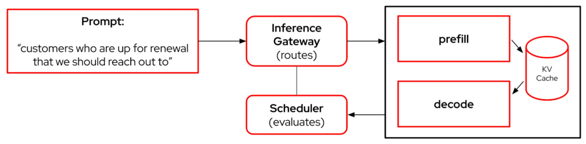

# 분산 AI 추론 서비스를 위한 llm-d

**목차**
1. [분산 AI 추론 서비스](llm-d_for_distributed_ai_inference.md#1-분산-ai-추론-서비스)<br>
2. [효율적인 추론을 위한 llm-d](llm-d_for_distributed_ai_inference.md#2-효율적인-추론을-위한-llm-d)<br>
3. [llm-d의 주요 기능](llm-d_for_distributed_ai_inference.md#3-llm-d의-주요-기능)<br>
4. [llm-d 데모 환경 테스트](llm-d_for_distributed_ai_inference.md#4-llm-d-데모-환경-테스트)<br>
5. [참조자료](llm-d_for_distributed_ai_inference.md#5-참조-자료)<br>

<br>
<br>

## 1. 분산 AI 추론 서비스

대규모 언어 모델(LLM)이 정적인 학습 기반(training-bound) 지식 회상에서 동적인 추론 시간(inference-time) 추론으로 전환됨에 따라, 이를 지원하는 인프라 또한 진화해야 합니다. 추론 워크로드는 더 이상 처리량에만 국한되지 않습니다. 복잡한 추론을 실제 환경에서 효율적으로 처리하기 위해서는 적응형 계산(adaptive computution), 모듈식 확장, 그리고 지능형 캐싱이 필요합니다.

llm-d는 이러한 새로운 LLM 애플리케이션을 위해 특별히 구축된 쿠버네티스 기반 분산 추론 스택입니다. 쿠버네티스와 vLLM에 기여한 개발자들이 설계한 llm-d는 대규모 모델을 대규모로 배포하는 팀에게 프로덕션급 경로를 제공합니다. 플랫폼 엔지니어든, DevOps 실무자든 llm-d는 다양한 가속기와 모델 제품군에서 비용 대비 향상된 성능을 제공합니다.

하지만 이는 단순한 추론 지원 솔루션이 아닙니다. llm-d는 AI 추론의 미래를 위해 설계되었으며, 장기 실행 다단계 프롬프트, 검색 증강 생성, 그리고 에이전트 워크플로를 최적화합니다. 이 솔루션은 KV 캐시 인식 라우팅, 분산형 사전-채우기(prefill)/디코드, vLLM 최적화 추론 스케줄러와 같은 최첨단 기술을 추론 게이트웨이(IGW: Inference Gateway)와 통합하여 원활한 쿠버네티스 기반 운영을 지원합니다.

<br>
<br>

## 2. 효율적인 추론을 위한 llm-d

### 2.1 llm-d 핵심

**llm-d의 핵심은 분산 모델 제공**
* 기존 애플리케이션과 달리 LLM 추론 요청은 일반적인 HTTP 요청과 크게 다름
* 기존의 쿠버네티스 부하 분산 및 확장 메커니즘은 추론 서비스에는 비효율적

**일반적인 LLM 추론 요청**
* 상태가 저장되고 비용을 많이 소비
* 입력 토큰과 출력 토큰의 차이에 따라 다양한 형태를 가짐
* 이 때문에, 비용 효율적인 AI 플랫폼을 구축하려면 인프라를 효과적으로 사용하는 것이 매우 중요
<br>

### 2.2 일박적인 추론 과정과 llm-d 기반 비교

#### 2.2.1 사용자가 LLM에 문의를 요청 시 추론 과정 기본 프로세스

1. "갱신 예정인 고객에게 연락" 요청
2. 사전-채우기(prefill) 단계 시작
3. 입력 토큰의 숨겨진 상태(KV 캐시라고도 함)를 병렬로 계산 -- 컴퓨팅 집약적
4. 디코딩 단계에서는 캐시된 키/값을 사용하여 한 번에 하나씩 토큰을 생성 -- 메모리 대역폭에 제약

--> 이 모든 작업이 단일 GPU에서 이루어진다면, 특히 긴 시퀀스의 경우 리소스 사용이 비효율적

#### 2.2.2 llm-d 기반 추론 과정



1. "갱신 예정인 고객에게 연락" 요청
2. llm-d는 분리(특수 노드 또는 GPU 간에 워크로드를 분리)와 추론 게이트웨이(kgateway)를 사용하여 수신 프롬프트를 평가
3. 요청을 지능적으로 라우팅

--> 성능과 비용 효율성을 획기적으로 향상
<br>
<br>

## 3. llm-d의 주요 기능

### 3.1 더 빠른 응답을 위한 스마트 로드 밸런싱

**추론 스케줄러**
* llm-d에는 각 요청이 올바른 모델 서버로 라우팅되도록 하는 특수 로드 스케줄러 포함
* 추론 스케줄러는 쿠버네티스의 Gateway API 추론 확장 기능을 사용하여 구축
* 추론 스케줄러는일반적인 지표를 사용하는 대신, 다음과 같은 실시간 성능 데이트를 기반으로 스마트 규칙을 사용
   + 시스템 부하
   + 메모리 사용량
   + 서비스 수준 목표
   + 기타 등등
* 이를 기반으로 각 프롬프트를 전송할 위치를 결정

**장점**
* 흐름 제어 및 지연 시간 밸런싱과 같은 기본 제공 기능을 활용
* 동시에 의사 결정 방식을 맞춤 설정

> [!NOTE]
> 이는 LLM 요청에 대한 트래픽 제어이지만 AI 기반 스마트 기능을 제공한다고 생각하면 됩니다.
<br>

### 3.2 분할 단계 추론: 더욱 스마트한 컴퓨팅 활용

* llm-d는 모든 작업을 동일한 머신에서 실행하는 대신 작업을 분할
  + 한 서버 세트는 프롬프트 이해(사전 채우기)를 처리
  + 다른 서버 세트는 응답 작성(디코딩)을 처리
* 이는 GPU를 더욱 효율적으로 사용하는 데 도움
  + 마치 한 셰프 그룹이 재료를 준비하는 동안 다른 셰프 그룹이 요리를 담당하는 것과 같음
  + vLLM과 NVIDIA Inference Xfer Library(NIXL) 또는 InfiniBand와 같은 고속 연결을 기반
<br>

### 3.3 분산 캐싱을 통해 이전 작업 재사용

* llm-d는 이전에 계산된 결과를 캐싱(KV 캐시)하여 모델이 더 효율적으로 기억할 수 있도록 지원
* 이러한 결과는 두 가지 방식으로 저장
  + 저비용, 무유지보수 절감을 위해 로컬(메모리 또는 디스크)에 저장
  + 대규모 시스템에서 더 빠른 재사용과 더 나은 성능을 위해 여러 서버에 걸쳐(공유 메모리 및 스토리지 사용) 저장
* 이를 통해 동일한 계산을 다시 수행하지 않고도 길거나 반복되는 프롬프트를 더 쉽게 처리
<br>
<br>

## 4. llm-d 데모 환경 테스트

### 4.1 llm-d 구성 환경

#### 4.1.1 일반적인 llm-d 구성 환경

* 대용량AI 모델을 타겟으로 함 (예: Llama-70B)
* GPU는 고성능 하이엔드 (예: NVidia H200s)

#### 4.1.2 데모 환경

**사전 캐시된 컨텐츠 인식 기반 라우팅 데모**
* 오픈시프트 4.17 이상
* NVidia GPU 오퍼레이터 25.3
* Node Feature Discovery 오퍼레이터 4.18
* 2 * Nvidia L40S GPU (예: AWS g6e.2xlarge 인스턴스)
* 모델 다운로드를 이한 허깅페이스 토큰
<br>

### 4.2 llm-d 설치

#### 4.2.1 리포지토리 복제

```bash
git clone https://github.com/llm-d-incubation/llm-d-infra.git
```

#### 4.2.2 관련 패키지 설치

```bash
cd quickstart
./dependencies/install-deps.sh
```
* 다음 항목 설치됨
  + Helmfile
  + Helm
  + 배포 및 구성을 위한 유틸리티 도구들

#### 4.2.3 게이트웨이 및 인프라 배포

```bash
cd gateway-control-plane-providers     
./install-gateway-provider-dependencies.sh
helmfile apply -f istio.helmfile.yaml
```

#### 4.2.4 예제 배포

예제 디렉터리로 이동
```bash
cd ../examples/precise-prefix-cache-aware 
```

프로젝트 생성
```bash
export NAMESPACE=llm-d-precise
oc new-project ${NAMESPACE}
```

허깅페이스 자격증명 설정
```bash
export HF_TOKEN=<사용자_토큰>
export HF_TOKEN_NAME=${HF_TOKEN_NAME:-llm-d-hf-token}
```

허깅페이스 토큰을 위한 시크릿 생성
```bash
oc create secret generic ${HF_TOKEN_NAME} \
  --from-literal="HF_TOKEN=${HF_TOKEN}" \
  --namespace "${NAMESPACE}" \
  --dry-run=client -o yaml | oc apply -f -
```

프로젝트에 헬름파일 적용
```bash
helmfile apply -n ${NAMESPACE}
```

#### 4.2.5 (옵션) GPU 노드가 taint 설정 되어 있으면 스케줄 활성화

실행 명령어
```bash
oc patch deployment ms-kv-events-llm-d-modelservice-decode \
  -p '{"spec":{"template":{"spec":{"tolerations":[{"key":"nvidia.com/gpu","operator":"Equal","value":"NVIDIA-L40S-PRIVATE","effect":"NoSchedule"}]}}}}'
```

> [!NOTE]
> 이 시점에서 *ms-kv-events-llm-d-modelservice-decode* 포드가 보류 중(Pending) 상태에 갇혔을 수 있습니다. 이는 일반적으로 GPU 노드에 taint가 적용되었을 때 발생합니다. 예를 들어 NVIDIA-L40S-PRIVATE(이 예시에서 사용하는 GPU)의 경우입니다.

#### 4.2.6 포드가 실행 중인지 확인

실행 명령어
```bash
oc get pods -n ${NAMESPACE}
```

실행 결과
```
NAME                                                       READY   STATUS    RESTARTS   AGE
gaie-kv-events-epp-5d4f98d6b6-sxf9w                        1/1     Running   0          25m
infra-kv-events-inference-gateway-istio-5f68d4f854-qpnq4   1/1     Running   0          25m
ms-kv-events-llm-d-modelservice-decode-648464d84b-2r58r    2/2     Running   0          22m
ms-kv-events-llm-d-modelservice-decode-648464d84b-lclzf    2/2     Running   0          18m
```
* 배포 완료
* 추론 게이트웨이를 통해 프롬프트를 전송하고 KV 캐시 인식 라우팅을 테스트 가능
<br>

### 4.3 KV 캐시 인식 기반 라우팅

#### 4.3.1 서비스 URL 확인

```bash
export SVC_EP=$(oc get svc infra-kv-events-inference-gateway-istio -o jsonpath='{.status.loadBalancer.ingress[0].ip}{.status.loadBalancer.ingress[0].hostname}')
```

#### 4.3.2 간단 연결 테스트

실행 명령어
```bash
curl http://$SVC_EP/v1/models
```

실행 결과 - JSON 형식
```json
{
  "data": [
    {
      "created": 1753453207,
      "id": "Qwen/Qwen3-0.6B",
      "max_model_len": 40960,
      "object": "model",
      "owned_by": "vllm",
      "parent": null,
      "permission": [
        {
          "allow_create_engine": false,
          "allow_fine_tuning": false,
          "allow_logprobs": true,
          "allow_sampling": true,
          "allow_search_indices": false,
          "allow_view": true,
          "created": 1753453207,
          "group": null,
          "id": "modelperm-28c695df952c46d1b6efac02e0edb62d",
          "is_blocking": false,
          "object": "model_permission",
          "organization": "*"
        }
      ],
      "root": "Qwen/Qwen3-0.6B"
    }
  ],
  "object": "list"
}
```

#### 4.3.3 테스트를 위한 200개 토큰보다 큰 메시지 설정

```bash
export LONG_TEXT_200_WORDS="Lorem ipsum dolor sit amet, consectetur adipiscing elit. Sed do eiusmod tempor incididunt ut labore et dolore magna aliqua. Ut enim ad minim veniam, quis nostrud exercitation ullamco laboris nisi ut aliquip ex ea commodo consequat. Duis aute irure dolor in reprehenderit in voluptate velit esse cillum dolore eu fugiat nulla pariatur. Excepteur sint occaecat cupidatat non proident, sunt in culpa qui officia deserunt mollit anim id est laborum. Lorem ipsum dolor sit amet, consectetur adipiscing elit. Sed do eiusmod tempor incididunt ut labore et dolore magna aliqua. Ut enim ad minim veniam, quis nostrud exercitation ullamco laboris nisi ut aliquip ex ea commodo consequat. Duis aute irure dolor in reprehenderit in voluptate velit esse cillum dolore eu fugiat nulla pariatur. Excepteur sint occaecat cupidatat non proident, sunt in culpa qui officia deserunt mollit anim id est laborum."
```

#### 4.3.4 이 프롬프트(메시지)를 llm-d 게이트웨이로 전송

```bash
curl http://$SVC_EP/v1/completions \
  -H "Content-Type: application/json" \
  -d '{
    "model": "Qwen/Qwen3-0.6B",
    "prompt": "'"$LONG_TEXT_200_WORDS"'",
    "max_tokens": 50
  }' | jq
```

#### 4.3.5 로그를 통해 접두사(prefix) 기준 라우팅 확인

실행 명령어
```bash
oc logs deployment/gaie-kv-events-epp -n llm-d --follow | grep "Got pod scores"
```

실행 결과
```
Got pod scores  {"x-request-id": "57dbc51d-8b2f-46a4-a88f-5a9214ee2277", "model": "Qwen/Qwen3-0.6B", "resolvedTargetModel": "Qwen/Qwen3-0.6B", "criticality": "Sheddable", "scores": null}
```
* 프롬프트가 null 점수를 반환
* 즉, 이전에 디코딩된 프롬프트와 일치하지 않음을 의미

#### 4.3.6 같은 다시지를 다시 전송

```bash
curl http://$SVC_EP/v1/completions \
  -H "Content-Type: application/json" \
  -d '{
    "model": "Qwen/Qwen3-0.6B",
    "prompt": "'"$LONG_TEXT_200_WORDS"'",
    "max_tokens": 50
  }' | jq
```

#### 4.3.7 로그를 통해 다시 확인

실행 명령어
```bash
oc logs deployment/gaie-kv-events-epp -n llm-d --follow | grep "Got pod scores"
```

실행 결과
```
Got pod scores  {"x-request-id": "585b72a7-71e4-4eaf-96bc-1642a74a9d8e", "model": "Qwen/Qwen3-0.6B", "resolvedTargetModel": "Qwen/Qwen3-0.6B", "criticality": "Sheddable", "scores": {"10.131.2.23":2}} 
```
* KV 캐시를 기반으로 선호하는 디코드 포드의 IP 주소를 가리키는 포인터로 프롬프트 점수 확인 가능
<br>

#### 4.3.8 디코드 파드의 개별 로그 확인

* 큰 프롬프트를 전송할 때 동일한 포드에서 활동이 발생
  + llm-d의 KV 캐시 인식 라우팅이 가장 적합한 디코드 파드로 요청을 지능적으로 전달
  + 이전에 계산된 결과를 활용하여 추론을 최적화하는 방법을 보여줌
* 이러한 접근 방식은 반복되거나 유사한 프롬프트에 대한 효율성을 크게 향상시키고 지연 시간을 줄여줌
<br>

### 4.4 요약

llm-d는 쿠버네티스의 운영 가능성을 기반으로 대규모 LLM 추론을 프로덕션 환경에서 실용적이고 효율적으로 만드는 데 있어 중요한 진전을 이룹니다. 지능형 요청 라우팅, KV 캐시 최적화, 사전 채우기/디코딩 분리에 중점을 두어 조직이 비용 효율적이고 성능이 뛰어난 방식으로 LLM 애플리케이션의 잠재력을 최대한 활용할 수 있도록 지원합니다.
<br>
<br>

## 5. 참조 자료

* [llm-d 프로젝트 리포지토리](https://github.com/llm-d/llm-d)
* [llm-d 퀵-스타트](https://github.com/llm-d/llm-d-deployer/tree/main/quickstart)
* [llm-d 커뮤니티 스택](https://inviter.co/llm-d-slack)
<br>
<br>

------
[차례](/README.md)