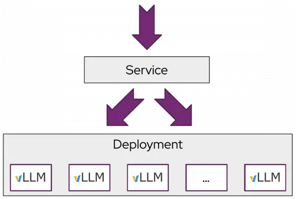
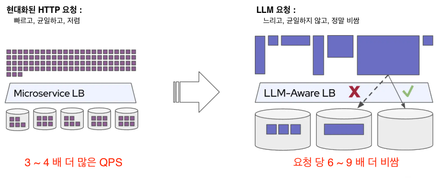
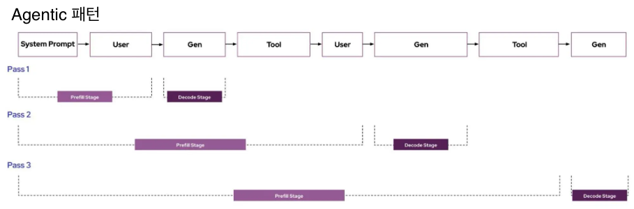
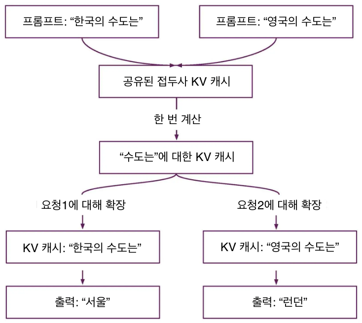
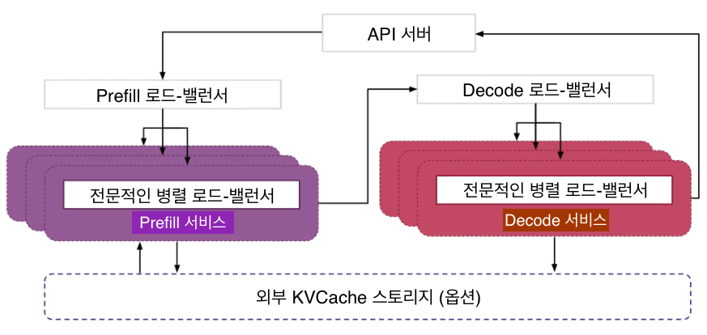
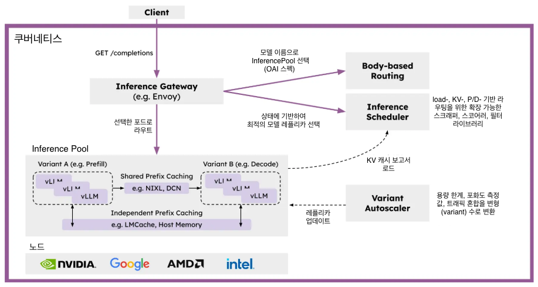
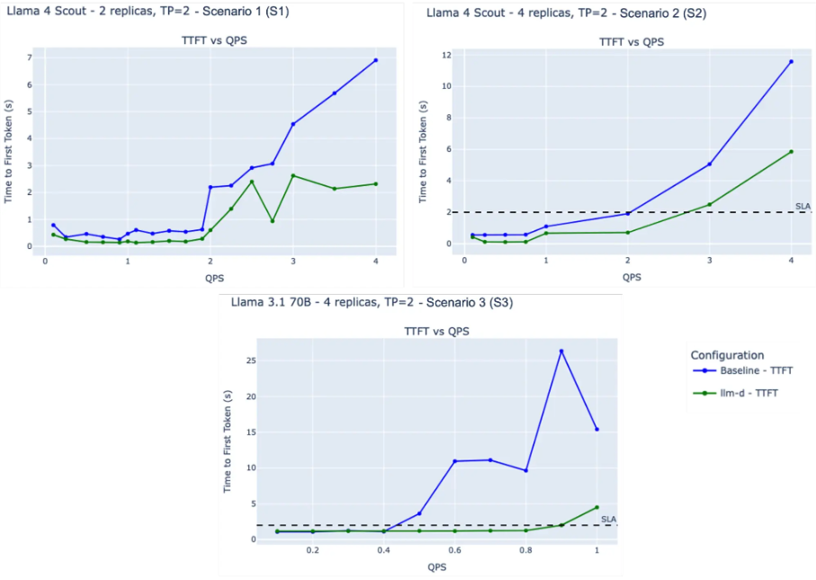

# llm-d: 쿠버네티스-네이티브 분산 추론

**목차**
1. [llm-d 개요](llm-d_for_k8s-native_distributed_inferencing.md#1-llm-d-개요) 
2. [LLM 추론 분산화](llm-d_for_k8s-native_distributed_inferencing.md#2-llm-추론-분산화) 
3. [llm-d가 필요한 이유](llm-d_for_k8s-native_distributed_inferencing.md#3-llm-d가-필요한-이유) 
4. [llm-d의 고성능 분산 서비스](llm-d_for_k8s-native_distributed_inferencing.md#4-llm-d의-고성능-분산-서비스) 

 
 

## 1. llm-d 개요

`llm-d`는 쿠버네티스 기반 고성능 분산 LLM 추론 프레임워크로, 누구나 대규모 서비스를 제공할 수 있는 최적의 경로이며, 대부분의 하드웨어 가속기에서 대부분의 모델에 대해 가장 빠른 가치 실현 시간과 경쟁력 있는 비용 대비 성능을 제공합니다.

`llm-d`를 사용하면 사용자는 KV 캐시 인식 라우팅 및 분산 서비스 제공과 같은 최신 분산 추론 최적화를 활용하는 모듈식 고성능 엔드-투-엔드 서비스 솔루션을 통해 생성형 AI 배포를 운영화할 수 있습니다. 이 솔루션은 쿠버네티스 추론 게이트웨이(IGW:Inference Gateway)의 운영 도구와 공동 설계 및 통합되었습니다.
 
 

## 2. LLM 추론, 분산화

### 2.1 표준 스케일-아웃의 한계

쿠버네티스는 일반적으로 균일한 복제본과 라운드 로빈 로드 밸런싱을 사용하여 애플리케이션 워크로드를 스케일아웃합니다. 반면에, LLM 추론 확장은 고유한 워크로드 특성으로 인하여 일반적인 애플리케이션보다 더 복잡합니다.

**예: 여러 vLLM 인스턴스에 서비스 배포**

* 위와 같은 패턴은 다음과 같은 특성을 가진 대부분의 서비스 요청(request) 패턴에 매우 효과적
  + 서비스 요청이 수명이 짧고 리소스 사용률이 일반적으로 균일
  + 서비스 요청이 일반적으로 균일한 지연 시간 서비스 수준 목표(SLO: Service Level Objectives)
  + 각 복제본은 모든 서비스 요청을 동등하게 처리
* 단일 서비스 요청에 대하여 변형을 특수화하고 복제본을 조정하여 처리하는 것이 필요한 경우 위와 같은 환경에서는 유용하지 않음
 

### 2.2 LLM 서빙의 고유한 특징

#### 2.2.1 요청은 비용이 많이 들고 리소스 활용도도 크게 다름

각 LLM 추론 요청은 입력 토큰과 출력 토큰의 개수로 측정되는 서로 다른 *"형태"*를 가지며, 이러한 매개변수는 요청과 워크로드에 따라 상당한 차이를 보입니다.

**사전 채우기 및 디코딩 단계에서의 `RAG 패턴` vs `사고/추론 패턴` 비교** 

* 패턴 비교
  + RAG는 긴 입력(즉시 처리 및 검색된 문서)과 짧은 생성 출력
  + 추론은 짧거나 중간 정도의 입력과 긴 생성 출력
* 이러한 요청 시간의 차이는 인스턴스 간에 상당한 불균형을 초래

**인스턴스 간 불균형**
* 로드된 인스턴스가 과부하 상태가 되면 불균형이 더욱 심화됨
* 과부하는 토큰 간 지연 시간(ITL: Inter-Token Latency)을 증가 → 부하 증가 → ITL 증가로 이어짐

#### 2.2.2 캐시된 사전 계산을 통해 특정 복제본으로 라우팅하면 대기 시간을 엄청나게 단축 가능

일반적으로 많은 LLM 워크로드는 동일한 프롬프트가 동일한 인스턴스에 반복적으로 전송되는 "멀티 턴" 요청 패턴을 가집니다.

* Agentic: 도구 호출이 반복적인 요청 흐름
* 코드 완성 작업: 요청이 현재 코드베이스를 컨텍스트로 재사용
 

vLLM과 같은 LLM 추론 서버는 *"자동 접두사 캐싱"*이라는 방법을 구현하여 캐시 적중 시 상당한 양의 사전 채우기 계산을 **건너뛸** 수 있도록 합니다.

**접두사 캐싱(Prefix Caching)**

* 캐시에 데이터가 있는 vLLM 복제본으로 요청이 라우팅되면, 계산을 건너뜀
* 캐시 크기가 클수록 접두사 캐시 적중 가능성이 높아지므로 테일 지연 시간을 크게 개선

#### 2.2.3 단일 요청을 처리하기 위해 복제본을 전문화하고 조정하면 GPU당 처리량이 더 높아짐

추론은 사전 채우기(prefill)와 디코딩(decode)의 두 단계로 나뉩니다.
|$\color{lime}{\texttt{항목}}$|$\color{lime}{\texttt{설명}}$|
|:---:|:---|
|사전 채우기|<ul><li>첫 번째 출력 토큰을 생성하고 모든 프롬프트 토큰에 대해 병렬로 실행</li><li>이 단계는 컴퓨팅에 의존</li></ul>|
|디코딩|<ul><li>모델에 대한 전체 패스를 수행</li><li>한 번에 하나씩 토큰을 생성</li><li>이 단계는 메모리 대역폭에 의존</li></ul>|

표준 LLM 배포는 위와 같이 단일 복제본 내에서 추론의 사전 채우기 및 디코딩 단계를 수행합니다.
* 추론의 사전 채우기 및 디코딩 단계는 리소스 요구 사항이 서로 다름
* 이러한 단계를 동일한 복제본에 배치하면 특히 긴 시퀀스의 경우 리소스 사용이 비효율적으로 발생

분리(예: Distserve)는 사전 채우기 및 디코딩 단계를 여러 변형으로 분리하여 각 단계의 독립적인 최적화 및 확장을 가능하게 합니다.

* 구글은 [TPU에서 분산 처리](https://cloud.google.com/blog/products/compute/whats-new-with-ai-hypercomputer)를 활용하여 첫 번째 토큰 지연 시간을 개선하고 운영 확장을 간소화
* DeepSeek은 공격적인 분리를 활용하여 대규모 환경에서 뛰어난 성능을 달성하는 [추론 시스템 설계에 대한 논의](https://github.com/deepseek-ai/open-infra-index/blob/main/202502OpenSourceWeek/day_6_one_more_thing_deepseekV3R1_inference_system_overview.md)를 발표

#### 2.2.4 실제 운영 환경에서는 종종 다양한 서비스 품질(QoS) 요구 사항이 적용

단일 LLM 엔드포인트의 사용 사례는 매우 다양한 서비스 품질 요구 사항을 가짐
|$\color{lime}{\texttt{지연 시간 중요도}}$|$\color{lime}{\texttt{설명}}$|$\color{lime}{\texttt{지연 시간 허용 범위}}$|
|:---:|:---|:---:|
|가장 중요한 요소|코드 완성 요청과 검색 응답은 "루프 내" 환경을 제공하기 위해 지연 시간을 최소화 필요|O ms|
|중요|대화형 사용 사례를 통한 채팅 에이전트 세션 및 이메일 작성 등|O 초|
|허용|일별 또는 시간별 사용 패턴을 가진 화상 통화 및 이메일 요약, "심층 조사" 에이전트|O 분|
|구애받지 않음|야간 일괄 처리 워크로드, 회의록 생성, 자율 에이전트 등|O 시간|

**QoS 및 비용**
* LLM의 컴퓨팅 집약도(따라서 높은 비용)를 고려할 때, 짧은 지연 시간 SLO를 달성하는 데는 훨씬 더 많은 비용 소요
* 다양한 지연 시간 요구 사항은 인프라 효율성을 더욱 최적화할 수 있는 기회를 제공
* 워크로드의 지연 시간 허용 범위가 클수록 다른 워크로드 중에서도 인프라 효율성을 최적화 가능
 
 

## 3. llm-d가 필요한 이유

### 3.1 추론 서비스를 위한 분산 클러스터 및 어려움

앞에서 설명한 LLM 워크로드의 특성에 따라 최적의 성능을 달성하기 위해서, 추론 서비스 환경은 분산 클러스터 규모 아키텍처로 빠르게 전환되고 있습니다.
* DeepSeek 팀은 오픈 소스 위크에서 분리 및 KV 캐싱을 적극적으로 활용하여 컴퓨팅 비용 대비 탁월한 성능을 달성하는 추론 시스템 설계를 공개

그러나 이는 쉽지 않으며 많은 기업 / 사용자들이 이러한 이점을 누리지 못하고 있습니다.
* 복잡하고 모놀리틱한 시스템을 구축하고 운영하는 것은 시간이 많이 소요되고 어려움
* 특히 수십 또는 수백 개의 모델을 다양한 사용 사례에 적용하면서, 빠르게 엔터프라이즈에 배포하고 혁신을 해야 하는 상황에서 더욱 어려움
* 이러한 복잡성은 출시 기간 단축, 운영 비용 증가, 무분별한 확장, 도입 및 실험의 어려움을 초래
 

### 3.2 llm-d의 목표

누구나 기존 배포 프레임워크인 쿠버네티스 내에서 선도적인 분산 추론 최적화를 도입할 수 있는 명확한 경로를 만드는 것입니다.

**목표 달성을 위한 설계 원칙**
|$\color{lime}{\texttt{설계 원칙}}$|$\color{lime}{\texttt{설명}}$|
|:---:|:---|
|운영성|추론 게이트웨이 API를 통해 쿠버네티스에 기본적으로 통합되는 모듈식의 복원력 있는 아키텍처|
|유연성|스택의 주요 구성 가능 계층을 확장 가능하게 구현하여 크로스 플랫폼(NVIDIA, Google TPU, AMD, Intel 지원 활성화) 지원|
|성능|분리 및 접두사 인식 라우팅과 같은 분산 최적화를 활용하여 SLO(서비스 수준 목표)를 충족하는 동시에 최고의 토큰/달러(token/$)를 달성|
 

### 3.3 목표 달성을 위한 아키텍처

업계 표준 오픈소스 기술인 vLLM, Kubernetes, Inference Gateway를 기반으로 모듈식 계층 아키텍처를 갖춘 llm-d를 설계

|$\color{lime}{\texttt{컴포넌트}}$|$\color{lime}{\texttt{설명}}$|
|:---:|:---|
|vLLM|<ul><li>업계를 선도하는 오픈소스 LLM 추론 엔진</li><li>다양한 모델(Llama 및 DeepSeek 포함)과 고성능 하드웨어 가속기(NVIDIA GPU, Google TPU, AMD 포함)를 지원</li></ul>|
|쿠버네티스|<ul><li>컨테이너화된 애플리케이션의 배포, 확장 및 관리를 자동화하는 오픈소스 컨테이너 오케스트레이션 엔진</li><li>다양한 하드웨어 가속기에 LLM 추론 엔진을 배포하고 업데이트하는 업계 표준</li></ul>|
|Inference Gateway(IGW)|<ul><li>추론 전용 라우팅을 통해 Gateway API(차세대 쿠버네티스 Ingress 및 부하 분산 API)를 확장하는 공식 쿠버네티스 프로젝트</li><li>모델 라우팅, 서비스 우선순위, "스마트" 부하 분산을 위한 확장 가능한 스케줄링 로직과 같은 여러 중요한 기능을 포함</li><li>Envoy 등 다양한 게이트웨이 구현과 통합되어 쿠버네티스 클러스터 전반에 걸쳐 폭넓게 이식 가능</li></ul>|
 

### 3.4 llm-d를 통한 분산 vLLM을 위한 지원 계획

#### 3.4.1 vLLM 최적화된 추론 스케줄러

IGW는 엔드포인트 피커 프로토콜(EPP: [Endpoint Picker Protocol](https://github.com/kubernetes-sigs/gateway-api-inference-extension/tree/main/docs/proposals/004-endpoint-picker-protocol))을 통해 사용자 정의 가능한 "스마트" 부하 분산 패턴을 정의합니다.
* vLLM에서 제공하는 향상된 운영 원격 측정 데이터를 활용
  + 추론 스케줄러는 분산 서빙, 프리픽스 캐시 인식, 부하 인식을 기반으로 "스마트" 스케줄링 결정을 내리는 데 필요한 필터링 및 스코어링 알고리즘을 구현
  + llm-d 사용자가 즉시 사용할 수 있도록 검증
* 고급 팀은 자체 스코어링 및 필터를 조정하거나 구현
  + 이를 통해 사용 사례에 맞게 더욱 맞춤 설정
  + 흐름 제어 및 지연 시간 인식 밸런싱과 같은 추론 게이트웨이의 향후 운영 기능의 이점 활용

#### 3.4.2 vLLM을 통한 분산 서비스 제공

llm-d는 플러그형 KV 커넥터 API를 통해 vLLM의 최근 지원 기능을 활용하여 NVIDIA NIXL과 같은 고성능 전송 라이브러리를 사용하여 독립 인스턴스에서 사전 채우기 및 디코딩을 실행합니다.

**사전 채우기/디코딩(P/D) 분산을 위한 지원 계획**
* 빠른 상호 연결(IB, RDMA, ICI)을 사용하여 지연 시간을 최적화
* 데이터 센터 네트워킹을 사용하여 처리량을 최적화

#### 3.4.3 vLLM을 활용한 분산 접두사 캐싱 (Prefix Caching)

llm-d는 분산 서빙에서 사용되는 것과 동일한 vLLM KV 커넥터 API를 사용하여 이전 계산을 위한 플러그형 캐시를 제공합니다. 여기에는 KV를 호스트, 원격 저장소 및 [LMCache](https://github.com/LMCache/LMCache)와 같은 시스템으로 오프로드하는 작업이 포함됩니다.

**KV 캐시 분산 지원 계획**
* 호스트 메모리 및 디스크로의 기본적인 오프로드를 제공하는 `독립 캐싱`은 모든 시스템 리소스를 활용하는 운영 비용 없는 메커니즘을 제공
* 인스턴스 간 KV 전송을 지원하는 `공유 캐싱`과 글로벌 인덱싱을 지원하는 공유 저장소는 운영상 더 복잡한 시스템을 희생하더라도 더 높은 성능을 제공할 수 있는 잠재력을 제공

#### 3.4.4 하드웨어, 워크로드 및 트래픽에 따른 다양한 자동 확장

**자동 확장에 대한 다양한 조건**
* 가속기 하드웨어는 컴퓨팅, 메모리 및 비용 측면에서 크게 다름
* 동일한 모델을 공유하는 워크로드는 필요한 서비스 품질에 따라 다름
* LLM 추론의 각 단계와 다양한 전문가 모델이 혼합된 모델은 컴퓨팅, 메모리 또는 네트워크 바인딩 여부에 따라 다름
* 수신 트래픽은 시간과 워크로드에 따라 다름

오늘날 이러한 모든 결정은 배포 시점에 이루어지며, 위와 같은 다양한 조건 때문에 자동 확장을 활성화하여 비용을 안전하게 절감하는 데 어려움을 겪고 있습니다.

**다음과 같은 트래픽 및 하드웨어 인식 자동 확장기를 구현 계획**
* AIBrix와 같은 최종 사용자 및 OSS 협력업체의 풍부한 경험을 바탕으로 구현 계획
* 각 모델 서버 인스턴스의 용량을 측정
* 다양한 요청 형태와 QoS를 고려하는 부하 함수를 도출
* 최근 트래픽 조합[QPS(초당 쿼리 수), QoS, 형태 분포]을 사용하여 사전 채우기, 디코딩 및 지연 시간 허용 요청을 처리하는 데 필요한 최적의 인스턴스 조합을 계산하고 각 인스턴스에 그룹화 레이블을 지정
* 쿠버네티스 수평적 포드 자동 확장이 SLO를 위반하지 않으면서 사용 중인 하드웨어와 필요한 하드웨어를 일치시킬 수 있도록 그룹화별 부하 지표를 보고
 
 

## 4. llm-d의 고성능 분산 서비스

### 4.1 Prefix 및 KV 캐시 인식 라우팅

llm-d에서 IGW와 vLLM 간의 핵심 협업으로 IGW의 기존 KV 캐시 사용률 인식 부하 분산을 보완하기 위한 `프리픽스 캐시 인식 라우팅` 입니다.

#### 4.1.1 테스트 환경

* 2개의 NVIDIA 8xH100 노드 기반 상에 프리픽스 인식 라우팅을 지원하는 llm-d 추론 스케줄러
* KV 캐시 재사용 및 라우팅 결정 품질을 강조하도록, [장입출력(Long-Input/Short-Output)으로 구성으로 설계된 LMbenchmark](https://github.com/LMCache/LMBenchmark/tree/main/synthetic-multi-round-qa)

#### 4.1.2 테스트 항목 별 구성 테이틀

||$\color{lime}{\texttt{모델}}$|$\color{lime}{\texttt{구성}}$|$\color{lime}{\texttt{ISL | OSL}}$|$\color{lime}{\texttt{지연 SLO}}$|
|:---:|:---:|:---:|:---:|:---:|
|S1|LlaMA 4 Scout FP8|TP2, 2 레플리카|20,000 | 100|None|
|S2|LlaMA 4 Scout FP8|TP2, 4 레플리카|12,000 | 100|P95 TTFT <= 2s|
|S3|Llama 3.1 70B FP16|TP2, 4 레플리카|8,000 | 100|P95 TTFT <= 2s|
* 약어 설명
  + ISL/OSL: Input Sequence Length / Output Sequence Length
  + SLO: Service Level Objective
  + TP(Tensor Parallelism), PP(Pipeline Parallelism), DP(Data Parallelism), SP(Sequence Parallelism), CP(Context Parallelism)
  + TTFT: Time to First Token
* S2/S3를 보면 95%가 2초 미만임

#### 4.1.3 테스트 결과

* 결과 설명
  + S1: 4-QPS에서 llm-d는 기준선보다 약 3배 낮은 평균 TTFT를 달성 (낮을수록 좋음)
  + S2: llm-d는 SLO 요구 사항을 충족하는 동시에 기준선보다 약 50% 높은 QPS를 제공 (높을수록 좋음)
  + S3: llm-d는 SLO 제약 조건 하에서 기준선의 2배 QPS를 유지 (높을수록 좋음)
* llm-d의 캐시 및 접두사 인식 스케줄링이 SLO 요구 사항을 일관되게 충족하는 동시에 기준 대비 TTFT를 효과적으로 줄이고 QPS를 증가시킴을 보여줌

> [!NOTE]
> 관련 내용은 GitHub에 게시된 [quick start](https://github.com/llm-d/llm-d-deployer/tree/main/quickstart)에서 `base.yaml` 파일로 확인할 수 있습니다.
 

### 4.2 P/D 분리

vLLM과 llm-d-inference-scheduler를 활용한 P/D 분리
* 사전 채우기(prefill)가 많은 워크로드(20:1 ISL | OSL)에서 유망한 속도 향상을 제공

> [!NOTE]
> 다음 목표는 이기종 TP 구현을 마무리하고 분리된 서빙에 대한 포괄적인 벤치마크를 완료하는 것입니다. 단기적인 우선순위로는 이기종 TP 지원, 대규모 MoE를 위한 고성능 P/D + EP<>DP 확장, 그리고 DP 인식 부하 분산 등이 있습니다. 관련 내용은 향후 업데이트 예정입니다.

> [!NOTE]
> 관련 내용은 GitHub에 게시된 [quick start](https://github.com/llm-d/llm-d-deployer/tree/main/quickstart)에서 `pd-nixl.yaml` 파일로 확인할 수 있습니다.
 
 

------
[차례](../README.md)
