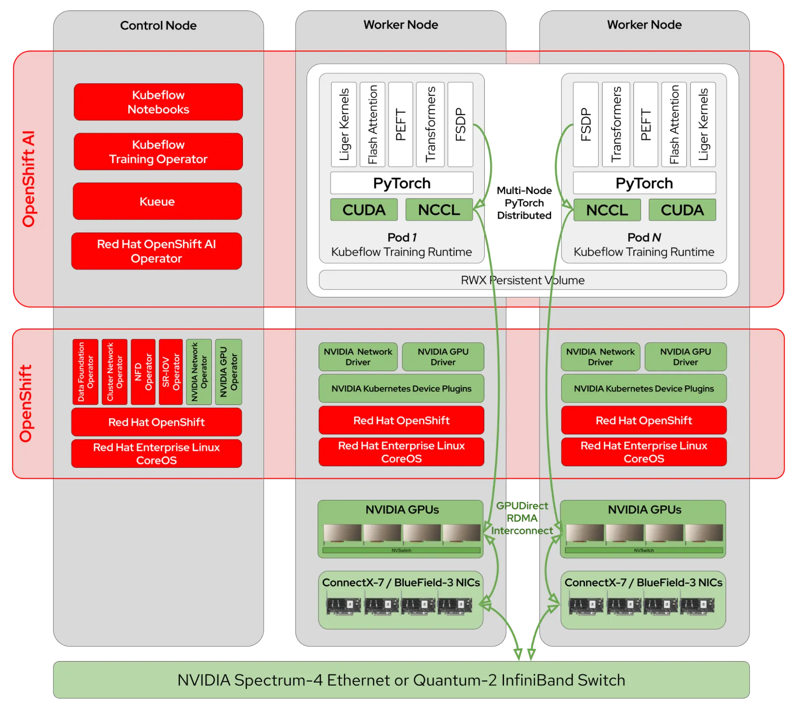
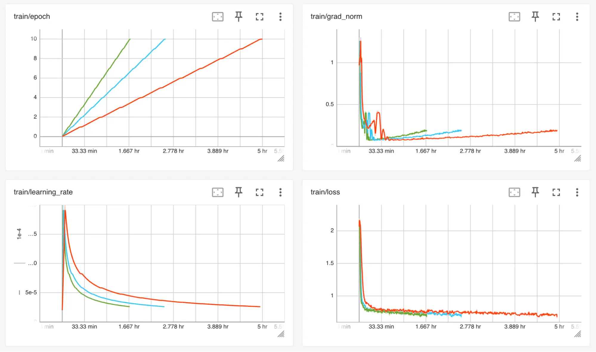
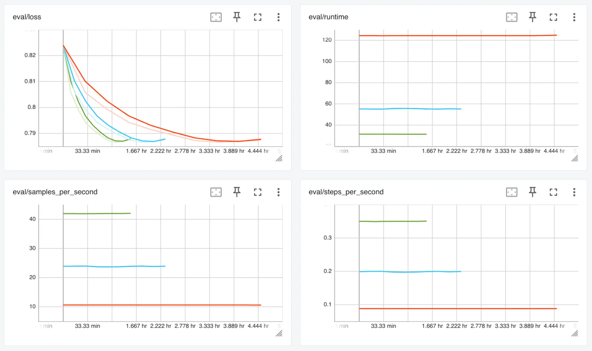
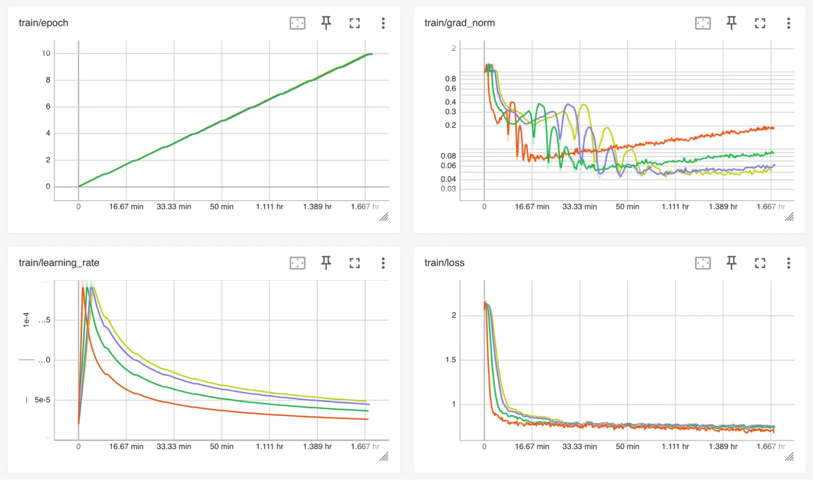
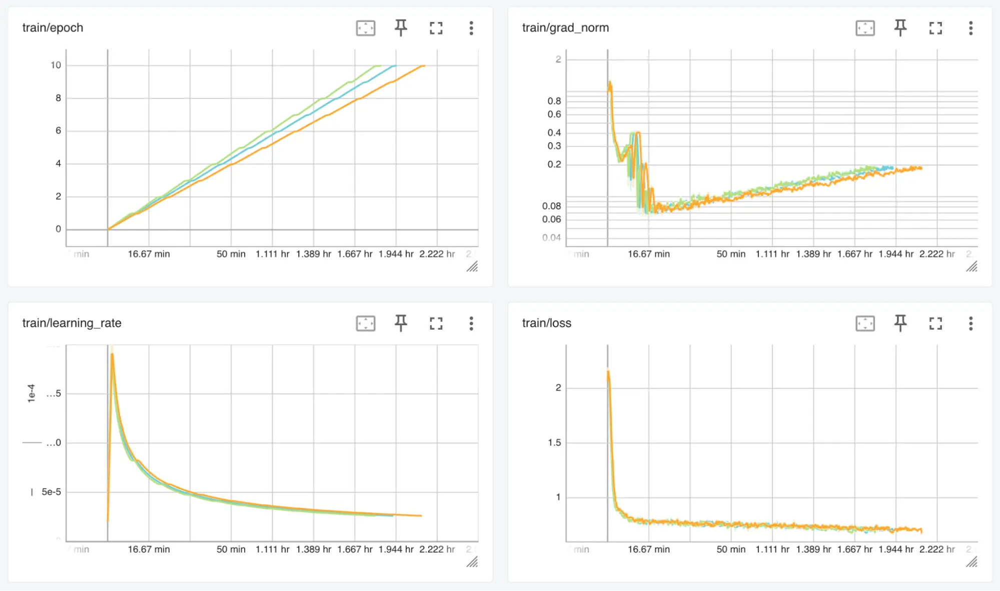

# NVidia GPUDirect RDMA를 모델 훈련 가속화

**목차**
1. [분산 모델 훈련](accelerate_model_training_with_nvidia_gpudirect_rdma.md#1-분산-모델-훈련)<br>
2. [분산 모델 훈련 아키텍처](accelerate_model_training_with_nvidia_gpudirect_rdma.md#2-분산-모델-훈련-아키텍처)<br>
3. [LLM Fine-Tuning](accelerate_model_training_with_nvidia_gpudirect_rdma.md#3-llm-fine-tuning)<br>
4. [요약](accelerate_model_training_with_nvidia_gpudirect_rdma.md#4-요약)<br>

<br>
<br>

## 1. 분산 모델 훈련

### 1.1 모델 스케일링 아웃

대규모 언어 모델(LLM)의 스케일링 아웃은 혁신의 속도를 유지하고 LLM 성능의 한계를 뛰어넘는 데 중요한 역할을 해왔으며, 이는 AI의 스케일링 법칙을 뒷받침하는 역할을 해왔습니다.

양자화나 압축과 같은 기술을 사용하여 이러한 대규모 모델을 단일 GPU에 로드하는 데 필요한 메모리 양을 줄일 수 있습니다. 하지만, 몇 가지 단점이 있으며 스케일링 아웃만이 유일한 선택지가 되게 하는 한계점을 높일 뿐입니다. 이와 같이 모델 훈련의 경우에는 스케일링 아웃을 통해 더 많은 컴퓨팅 리소스를 활용하고 지연 시간을 단축할 수도 있습니다.
<br>

### 1.2 커뮤니케이션 오버헤드

그러나 딥러닝을 확장하면 GPU 간에 계산을 수행하기 위한 통신 오버헤드가 상당히 많이 발생합니다. 예를 들어 PyTorch FSDP 또는 DeepSpeed ​​ZeRO를 사용하여 모델을 훈련할 때, 모든 계층이 순방향 및 역방향을 통과하기 전에 모든 GPU에 샤딩된 가중치가 수집되고, 모든 미니 배치가 끝날 때 로컬 그래디언트가 감소 및 분산됩니다. 모델의 크기와 GPU 수에 따라 이는 최대로 몇 Gbps의 트래픽을 나타낼 수 있습니다.

표준 오픈시프트 클러스터에서 해당 트래픽은 기본적으로 *OVN-Kubernetes* 네트워크 CNI 플러그인을 통해 전송됩니다. 이는 AI 애플리케이션에 적합하지 않은 범용 포드 간 통신을 제공하는 네트워크 가상화 솔루션인 OVN(Open Virtual Network)에 의존합니다. 실제로 이러한 오버헤드는 분산 모델 훈련 속도를 상당히 저하시켜 병목 현상이 발생하는 지점까지 이르게 합니다.

<br>

### 1.3 분산 모델 훈련을 위한 효율적인 스케일링 아웃

여러 기업들은 오픈소스 LLM 교육을 선도하며 이러한 병목 현상을 완화하기 위한 인프라 설계 연구를 공유해 왔습니다. Meta Scale에서 분산 AI 훈련을 위한 *RDMA over Ethernet*와 같이, 이들은 모두 분산 모델 훈련을 효율적으로 스케일링 아웃하는 데 있어 저지연/고대역폭 네트워킹이 얼마나 중요한지 강조했으며, **Llama** 또는 **Granite** 모델 훈련에 *GPUDirect RDMA over Converged Ethernet(RoCE)*을 사용하기로 결정했습니다.

레드햇 오픈시프트 AI 2.19부터는 고속 GPU 상호 연결을 갖춘 **NVIDIA Spectrum-X**와 같은 네트워킹 플랫폼을 활용하여 *GPUDirect RDMA over Ethernet* 또는 *InfiniBand* 물리적 링크를 통해 모델 훈련을 가속화할 수 있습니다.
<br>
<br>

## 2. 분산 모델 훈련 아키텍처

### 2.1 레드햇의 고성능 분산 모델 훈련 아키텍처

NVidia와 레드햇은 NVidia 가속 컴퓨팅 및 네트워킹 스택과 레드햇의 선도적인 컨테이너 오케스트레이션 플랫폼인 오픈시프트의 장점을 최대한 활용하기 위해 수년간 협력해 왔으며, 이를 통해 레드햇 오픈시프트 AI는 다음과 같은 아키텍처를 통해 고성능 분산 모델 훈련을 구현할 수 있습니다.



* NVidia Spectrum-X 플랫폼 기반의 GPUDirect RDMA 
  + Spectrum-4 이더넷 스위치
  + BlueField-3 SuperNIC
<br>

### 2.2 솔루션 구성 컴포넌트

|$\color{lime}{\texttt{컴포넌트}}$|$\color{lime}{\texttt{설명}}$|
|:---|:---|
|NVidia 네트워크 오퍼레이터|네트워킹 드라이버, 장치 플러그인, 보조 네트워크 NIC 플러그인 및 NVidia NIC 기능 검색과 같은 NVidia 네트워킹 구성 요소의 노드 배포를 자동화|
|NVidia GPU 오퍼레이터|컨테이너가 GPU를 사용할 수 있도록 노드에서 소프트웨어 구성 요소의 배포를 자동화하고 NVidia 네트워크 오퍼레이터와 협력하여 GPU와 NIC 간에 GPUDirect RDMA를 활성화|
|NVidia Collective Communication Library (NCCL)|[Collective Operations](https://docs.nvidia.com/deeplearning/nccl/user-guide/docs/usage/collectives.html)을 구현하고 GPU 상호 연결 토폴로지를 감지하여 NVLink 및 GPUDirect RDMA(사용 가능한 경우)를 사용하여 노드 내 및 노드 간 통신을 최적화하며, [PyTorch Distributed](https://docs.pytorch.org/docs/stable/distributed.html) 패키지에 통신 백엔드로 통합|
|파이토치 [Fully-Sharding-Data-Parallel](https://pytorch.org/tutorials/intermediate/FSDP_tutorial.html) (FSDP)|모델을 여러 워커에 걸쳐 분할하고 훈련을 분산시켜 여러 GPU에서 매우 큰 모델을 훈련하는 것이 가능|
|허깅페이스 [Transformers](https://huggingface.co/docs/transformers) 및 [Parameter-Efficient Fine-Tuning](https://huggingface.co/docs/peft) (PEFT)|미리 훈련 된 모델을 처리하고 SFT (Supervised Fine-Tuning) 및 LORA (Low Rank Adaptation)를 구현하기위한 모든 복잡성을 추상화|
|Kubeflow Training 오퍼레이터|오픈시프트 상에서 파이토치 분산 훈련 작업을 구성|
|Kueue|멀티 테넌트 환경에서 GPU 할당량 관리 및 공정한 사용 공유 기능을 제공|
|오픈시프트 클러스터 네트워크 오퍼레이터|*OVN-Kubernetes* CNI 플러그인 (기본적으로)을 구성하고, 포드의 두 번째 네트워크 인터페이스를 관리하는 MULTUS CNI 플러그인을 배포|
|SR-IOV 오퍼레이터|SR-IOV 스택을 설정하여 가상 함수(VF: Virtual Function)를 통해 호환 가능한 PCIe 네트워크 장치를 여러 포드에 연결|
|오픈시프트 데이터 파운데이션 오퍼레이터|분산 체크포인팅에 사용되는 공유 파일 시스템 볼륨 프로비저닝을 제공|
<br>
<br>

## 3. LLM Fine-Tuning

### 3.1 네트워킹 플랫폼 구성

#### 3.1.1 **NicClusterPolicy** 리소스

```yaml
apiVersion: mellanox.com/v1alpha1
kind: NicClusterPolicy
metadata:
  name: nic-cluster-policy
spec:
  nicFeatureDiscovery:
    image: nic-feature-discovery
    repository: ghcr.io/mellanox
    version: v0.0.1
  nvIpam:
    image: nvidia-k8s-ipam
    repository: ghcr.io/mellanox
    version: v0.2.0
  ofedDriver:
    repository: nvcr.io/nvidia/mellanox
    image: doca-driver
  rdmaSharedDevicePlugin:
    config: |
      {
        "configList": [
          {
            "resourceName": "rdma_shared_device_eth",
            "rdmaHcaMax": 63,
            "selectors": {
              "ifNames": ["ens8f0np0"]
            }
          }
        ]
      }
    repository: ghcr.io/mellanox
    version: v1.5.2
```
* *spec.rdmaSharedDevicePlugin* 필드
  + *resourceName*: 확장 리소스 이름 
  + *rdmaHcaMax*: 미세 조정 작업 리소스 요청 
  + *selectors*: RoCE 네트워크 인터페이스

#### 3.1.2 **MacvlanNetwork** 리소스

```yaml
apiVersion: mellanox.com/v1alpha1
kind: MacvlanNetwork
metadata:
  name: rdmashared-net
spec:
  ipam: '{"type": "whereabouts", "range": "192.168.2.0/24", "gateway": "192.168.2.1"}'
  master: ens8f0np0
  mode: bridge
  mtu: 1500
```
* *RDMA over Converged Ethernet (RoCE)* 리소스

#### 3.1.3 **NetworkAttachementDefinition** 리소스

```yaml
apiVersion: k8s.cni.cncf.io/v1
kind: NetworkAttachmentDefinition
metadata:
  name: rdmashared-net
spec:
  config: '{ "cniVersion":"0.3.1", "name":"rdmashared-net", "type":"macvlan","master": "ens8f0np0","mode" : "bridge","mtu" : 1500,"ipam":{"type":"whereabouts","range":"192.168.2.0/24","gateway":"192.168.2.1"} }'
```

#### 3.1.4 **ClusterPolicy** 리소스

```yaml
apiVersion: nvidia.com/v1
kind: ClusterPolicy
metadata:
  name: gpu-cluster-policy
spec:
  driver:
    rdma:
      enabled: true
```
* *spec.driver.rdma.enabled*: GPU 디바이스 상에서 GPUDirect RDMA를 활성화하기 위해 `true`로 설정
* 설정 값에 따라 NVidia GPU 오퍼레이터를 구성
<br>

### 3.2 `root`가 아닌 사용자를 위해 RDMA를 활성화하도록 컨테이넌 엔진(CRI-O) 구성

#### 3.2.1 GPU 노드간 통신

**요구 사항**
* GPU 노드 간 통신은 RDMA를 통해 버퍼 복사 없이 이루어져야 함
* 이를 위해 가상 주소로 매핑된 호스트 메모리의 고정된 메모리 블록을 CUDA를 통해 할당 및 등록

**제한 사항 및 방안**
* 루트가 아닌 사용자에게 할당할 수 있는 메모리 양은 일반적으로 NCCL에 필요한 것보다 너무 제한적인 기본값으로 설정됨
* 이 때문에, 루트가 아닌 사용자로 제한적인 오픈시프트 기본 보안 컨텍스트를 사용하면 메모리가 제한됨
* 모델 훈련 프로세스를 실행하려면, 컨테이너 엔진(CRI-O) 구성에서 이러한 제한을 늘려야 하며, Machine Configuration Opeartor(MCO)로 이를 구성

#### 3.2.2 MCO 구성

```yaml
apiVersion: machineconfiguration.openshift.io/v1
kind: MachineConfig
metadata:
  labels:
    machineconfiguration.openshift.io/role: worker
  name: 02-worker-container-runtime
spec:
  config:
    ignition:
      version: 3.2.0
    storage:
      files:
        - contents:
            inline: |
              [crio.runtime]
              default_ulimits = [
                "memlock=-1:-1"
              ]
          mode: 420
          overwrite: true
          path: /etc/crio/crio.conf.d/10-custom
```
* **crio.runtime**에서 *default_ulimits* 내에, memlock의 값을 `-1:-1`(unlimite)로 설정 
* 예제처럼 사용자 스페이스 애플리케이션에서 고정된 메모리를 무제한으로 할당할 수 있지만, 애플리케이션에 맞게 충분히 큰 고정된 한도로 설정하는 것을 권장
* MachineConfig 리소스가 생성되면 해당 리소스가 적용되도록 해당 워커 노드를 다시 시작
<br>

### 3.3 예제 실행

#### 3.3.1 Fine-Tuning을 위한 구성 파일

**config.yaml** 파일
```yaml
# Model
model_name_or_path: Meta-Llama/Meta-Llama-3.1-8B-Instruct
model_revision: main
torch_dtype: bfloat16
attn_implementation: flash_attention_2    # one of eager (default), sdpa or flash_attention_2
use_liger: true                           # use Liger kernels

# PEFT / LoRA
use_peft: true
lora_r: 16
lora_alpha: 8
lora_dropout: 0.05
lora_target_modules: ["q_proj", "v_proj", "k_proj", "o_proj", "gate_proj", "up_proj", "down_proj"]

# Dataset
dataset_name: gsm8k                       # id or path to the dataset
dataset_config: main                      # name of the dataset configuration
dataset_train_split: train                # dataset split to use for training
dataset_test_split: test                  # dataset split to use for evaluation
dataset_text_field: text                  # name of the text field of the dataset

# SFT
max_seq_length: 4096                      # max sequence length for model and packing of the dataset

# Training
num_train_epochs: 10                      # number of training epochs

per_device_train_batch_size: 32           # batch size per device during training
per_device_eval_batch_size: 32            # batch size for evaluation
eval_strategy: epoch                      # evaluate every epoch

bf16: true                                # use bf16 16-bit (mixed) precision
tf32: false                               # use tf32 precision

learning_rate: 2.0e-4                     # initial learning rate
warmup_steps: 10                          # steps for a linear warmup from 0 to `learning_rate`
lr_scheduler_type: inverse_sqrt           # learning rate scheduler (see transformers.SchedulerType)

# FSDP
fsdp: "full_shard auto_wrap"              # add offload if not enough GPU memory
fsdp_config:
  activation_checkpointing: true

# Checkpointing
save_strategy: epoch                      # save checkpoint every epoch
save_total_limit: 1                       # limit the total amount of checkpoints

# Logging
log_level: warning                        # logging level (see transformers.logging)
logging_strategy: steps
logging_steps: 1                          # log every N steps
report_to:
  - tensorboard                           # report metrics to tensorboard

output_dir: /mnt/shared/Meta-Llama-3.1-8B-Instruct
```
* 모델: 사전 학습된 Meta-Llama/Meta-Llama-3.1-8B-Instruct
* 데이터 셋: 허깅페이스의 GSM8K

#### 3.3.2 Fine-Tuning 내용을 가진 훈련 스크립트

**sft.py** 스크립트 (SFT: Supervised Fine-Tuning)
```py
from datasets import load_dataset
from transformers import AutoTokenizer, set_seed
from trl import (
    ModelConfig,
    ScriptArguments,
    SFTConfig,
    SFTTrainer,
    TrlParser,
    get_peft_config,
    get_quantization_config,
    get_kbit_device_map,
)

def train(script_args, training_args, model_args):
    # model and tokenizer
    quantization_config = get_quantization_config(model_args)
    training_args.model_init_kwargs = dict(
        revision=model_args.model_revision,
        trust_remote_code=model_args.trust_remote_code,
        attn_implementation=model_args.attn_implementation,
        torch_dtype=model_args.torch_dtype,
        use_cache=False if training_args.gradient_checkpointing or
            training_args.fsdp_config.get("activation_checkpointing", False) else True,
        device_map=get_kbit_device_map() if quantization_config is not None else None,
        quantization_config=quantization_config,
    )
    tokenizer = AutoTokenizer.from_pretrained(model_args.model_name_or_path,
        trust_remote_code=model_args.trust_remote_code,
        use_fast=True)
    if tokenizer.pad_token is None:
        tokenizer.pad_token = tokenizer.eos_token

    # training and evaluation datasets
    train_dataset = load_dataset(
        path=script_args.dataset_name,
        name=script_args.dataset_config,
        split=script_args.dataset_train_split,
    )
    test_dataset = None
    if training_args.eval_strategy != "no":
        test_dataset = load_dataset(
            path=script_args.dataset_name,
            name=script_args.dataset_config,
            split=script_args.dataset_test_split,
        )

    # templatize datasets
    def template_dataset(sample):
        messages = [
            {"role": "user", "content": sample['question']},
            {"role": "assistant", "content": sample['answer']},
        ]
        return {"text": tokenizer.apply_chat_template(messages, tokenize=False)}

    train_dataset = train_dataset.map(template_dataset,
                                      remove_columns=["question", "answer"])
    if training_args.eval_strategy != "no":
        test_dataset = test_dataset.map(template_dataset,
                                        remove_columns=["question", "answer"])

    # training loop
    trainer = SFTTrainer(
        model=model_args.model_name_or_path,
        args=training_args,
        train_dataset=train_dataset,
        eval_dataset=test_dataset,
        peft_config=get_peft_config(model_args),
        processing_class=tokenizer,
    )

    if trainer.accelerator.is_main_process and hasattr(trainer.model, "print_trainable_parameters"):
        trainer.model.print_trainable_parameters()

    checkpoint = None
    if training_args.resume_from_checkpoint is not None:
        checkpoint = training_args.resume_from_checkpoint

    trainer.train(resume_from_checkpoint=checkpoint)

    trainer.save_model(training_args.output_dir)

    with training_args.main_process_first(desc="Training completed"):
        print(f"Training completed, model checkpoint written to {training_args.output_dir}")

parser = TrlParser((ScriptArguments, SFTConfig, ModelConfig))
script_args, training_args, model_args = parser.parse_args_and_config()
set_seed(training_args.seed)
train(script_args, training_args, model_args)
```

#### 3.3.3 ConfigMap 생성

실행 명령어
```bash
oc create configmap sft --from-file=config.yaml=config.yaml --from-file=sft.py=sft.py
```
* 두 개의 파일 config.yaml 및 sft.py을 가지고 ConfigMap을 생성
  + 해당 파일은 PyTorchJob 포드에 마운트

#### 3.3.4 (옵션) PVC 생성

**pvc.yaml** 파일
```yaml
apiVersion: v1
kind: PersistentVolumeClaim
metadata:
  name: shared
spec:
  accessModes:
  - ReadWriteMany
  resources:
    requests:
      storage: 500Gi
  storageClassName: ocs-storagecluster-cephfs
```
* PVC를 아직 만들지 않았다면, 생성
* *spec.storageClassName*는 구성된 스토리지로 설정

실행 명령어
```bash
kubectl apply -f pvc.yaml
```

#### 3.3.5 **PyTorchJob** 리소스

**SFT-Baseline** 구성 YAML
```yaml
apiVersion: kubeflow.org/v1
kind: PyTorchJob
metadata:
  name: sft-baseline
spec:
  nprocPerNode: "2"
  pytorchReplicaSpecs:
    Master:
      replicas: 1
      template: &template
        spec:
          containers:
            - name: pytorch
              command:
                - bash
                - -c
                - torchrun /etc/config/sft.py --config /etc/config/config.yaml
              env:
                - name: HF_HOME
                  value: /mnt/shared/.cache
                - name: HF_TOKEN
                  value: ""
                - name: PYTORCH_CUDA_ALLOC_CONF
                  value: "expandable_segments:True"
                - name: NCCL_DEBUG
                  value: INFO
              image: "quay.io/modh/training:py311-cuda121-torch241"
              resources:
                limits: &resources
                  cpu: "4"
                  memory: 96Gi
                  nvidia.com/gpu: "2"
                requests: *resources
              volumeMounts:
                - mountPath: /etc/config
                  name: config
                - mountPath: /mnt/shared
                  name: shared
                - name: shm
                  mountPath: /dev/shm
          volumes:
            - configMap:
                name: sft
              name: config
            - name: shared
              persistentVolumeClaim:
                claimName: shared
            - name: shm
              emptyDir:
                medium: Memory
                sizeLimit: 2Gi
    Worker:
      replicas: 1
      template: *template
```
* *spec.nprocPerNode*: `2` (노드 당 GPU 2개)
* 노드 내 및 노드 간 통신을 테스트하기 위해 두 개의 GPU가 연결된 두 개의 포드로 구성

#### 3.3.6 업데이트된 PyTorchJob 리소스

**SFT-RoCE** 구성 YAML
```yaml
apiVersion: kubeflow.org/v1
kind: PyTorchJob
metadata:
  name: sft-roce
spec:
  pytorchReplicaSpecs:
    Master:
      template: &template
        metadata:
          annotations:
            k8s.v1.cni.cncf.io/networks: "rdmashared-net"
        spec:
          containers:
            - name: pytorch
              env:
                - name: NCCL_SOCKET_IFNAME
                  value: "net1"
                - name: NCCL_IB_HBA
                  value: "mlx5_1"
              resources:
                limits: &resources
                  rdma/rdma_shared_device_eth: "1"
```
* 네트워크 구성을 고려하여, *RDMA over Ethernet(RoCE)*을 사용하게 하는 `sft-baselin`에 적용하는 패치 YAML
* *spec.pytorchReplicaSpecs.Master.template*
  + *metadata.annotations."k8s.v1.cni.cncf.io/networks"*
    - 보조 네트워크를 PyTorchJob 포드에 연결
  + *spec.containers* 중 `pytorch` 컨테이너의 환경 변수 NCCL_SOCKET_IFNAME:net1
    - NCCL이 이 보조 네트워크를 통해 통신하기 위해 네트워크 인터페이스를 사용하도록 지시
  + *spec.containers* 중 `pytorch` 컨테이너의 환경 변수 NCCL_IB_HCA:mlx5_1
    - NCCL이 사용할 호스트 채널 어댑터(HCA)를 지정
    - 환경 변수가 설정 되지 않으면, 자동으로 검색
  + *spec.containers* 중 `pytorch` 컨테이너의 리소스 rdma/rdma_shared_device_eth:1

#### 3.3.7 진행 사항 확인

실행 명령어
```bash
oc logs -l training.kubeflow.org/job-role=master -f
```

실행 결과 - NCCL이 적절히 구성되었다면, 다음 메시지 확인 가능
```log
NCCL INFO NET/IB : Using [0]mlx5_1:1/RoCE [RO]; OOB net1:192.168.2.5<0>
NCCL INFO NET/IB : GPU Direct RDMA Enabled for HCA 0 'mlx5_1'
NCCL INFO GPU Direct RDMA Enabled for GPU 1 / HCA 1
NCCL INFO GPU Direct RDMA Enabled for GPU 0 / HCA 1
NCCL INFO Channel 00/0 : 2[0] -> 1[1] [receive] via NET/IB/1/GDRDMA
NCCL INFO Channel 01/0 : 2[0] -> 1[1] [receive] via NET/IB/1/GDRDMA
NCCL INFO Channel 00/0 : 0[0] -> 3[1] [send] via NET/IB/1/GDRDMA
NCCL INFO Channel 01/0 : 0[0] -> 3[1] [send] via NET/IB/1/GDRDMA
```
<br>

### 3.4 성능 비교

#### 3.4.1 테스트 환경

* Dell PowerEdge-R760xa * 2대
* NVidia A40 GPU * 2장 (각 노드 당)
* NIC 모드로 설정된 BludeField-3 DPU * 2장
* NVidia Spectrum-4 이더넷 스위치

#### 3.4.2 테스트 시나리오 별 기본 파이토치 작업 테스트 결과

1. 기본 OVN 네트워크를 사용 - 5시간
2. RDMA over Ethernet을 사용 - 1시간 40분
   + 미세 조정 시간을 3분의 1로 단축
3. NVidia Spectrum-4에 연결된 보조 인터페이스 사용 및 NCCL을 RDMA over Ethernet 대신 TCP 소켓 사용 - 2시간 30분
   + OVN 대비 2분 1로 단축

#### 3.4.3 다양한 네트워크 구성에 따른 훈련 성능 지표



* green - GPUDirect RDMA
* blue - Spectrum-4 이더넷 스위치에 연결된 TCP 소켓
* red - 기본 OVN 네트워크

#### 3.4.4 다양한 네트워크 구성에 따른 평가 성능 지표



* green - GPUDirect RDMA
* blue - Spectrum-4 이더넷 스위치에 연결된 TCP 소켓
* red - 기본 OVN 네트워크

#### 3.4.5 다른 배치 크기에 따른 RDMA over Ethernet의 모델 훈련 성능 지표

GPUDirect RDMA에 의에 모델 훈련은 더 이상 IO가 아닌 컴퓨팅에 따라 영향을 받음



* *learning_rate* 메트릭 차트에서, 왼쪽에서 오른쪽으로, 32/64/96/112의 배치 크기

#### 3.4.6 Flash Attention & Liger Kernel에 따른 모델 훈련 성능 지표

GPUDirect RDMA에 의해 모델 훈련이 컴퓨팅 바운드가 됨
* Flash Attention과 Liger Kernel의 융합 커널을 사용함으로써 얻는 속도 향상의 이점도 제공



* green - Flash Attention + Liger Kernel
* blue - Flash Attention
* red - 기본 attention 구현, 커널 최적화 없음
<br>
<br>

## 4. 요약

LLM(그리고 일반적으로 딥 러닝 모델) 훈련은 본질적으로 매우 반복적인 프로세스입니다. 실험 단계에서 개발 주기를 단축하는 것은 경쟁 우위를 제공하며, 통신의 병목 현상을 제거하는 것은 GPU의 막대한 컴퓨팅 성능을 최대한 활용하는 데 필수적입니다.

앞에서 설명한 전형적인 LLM Fine-Tuning 사례를 통해 NVidia GPUDirect RDMA가 모델 분산 훈련에서 이러한 통신 병목 현상을 어떻게 제거할 수 있는지 보여주었습니다. 또한 GPU의 컴퓨팅 성능에 맞는 네트워킹 플랫폼에 투자하는 것이 얼마나 중요한지 강조했습니다.

NVidia GPUDirect RDMA는 분산 모델 서빙과 같은 다른 사용 사례의 가속화를 지원합니다. NVidia GPUDirect는 스토리지와 GPU 메모리 간의 데이터 이동을 가속화하는 GPUDirect 스토리지와 같은 다른 기술의 기반이 됩니다.

레드햇 오픈시프트 AI는 Spectrum-X와 같은 고성능 NVidia 네트워킹 플랫폼과 선도적인 컨테이너 오케스트레이션 플랫폼인 오프시프트를 통해 최고의 하드웨어와 소프트웨어를 지원하는 다재다능하면서도 강력한 AI/ML 플랫폼을 제공할 수 있습니다.
<br>
<br>

------
[차례](/README.md)