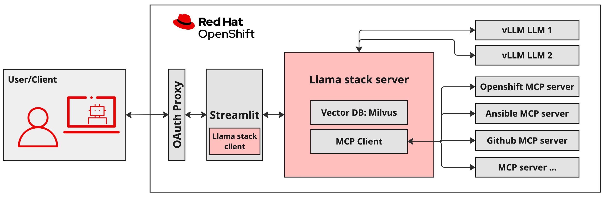

# 오픈시프트 상에 Llama 스택

1. [랩 목적 및 테스트 환경](intro_of_llama_stack_on_openshift.md#1-랩-목적-및-테스트-환경) 
2. [vLLM을 통한 RHOAI 모델 배포](intro_of_llama_stack_on_openshift.md#2-vllm을-통한-rhoai-모델-배포) 
3. [Llama 슬랙 서버](intro_of_llama_stack_on_openshift.md#3-llama-슬랙-서버) 
4. [MCP 서버](intro_of_llama_stack_on_openshift.md#4-mcp-서버) 
5. [RHOAI 워크벤치의 노트북](intro_of_llama_stack_on_openshift.md#5-rhoai-워크벤치의-노트북) 

 
 

## 1. 랩 목적 및 테스트 환경

### 1.1 목적

* 사용자 지정 데이터 소스에서 정보를 검색하기 위해 Llama 스택과 함께 검색 증강 생성(RAG)을 사용
* 다양한 도구를 사용하여 기능을 확장하고 특정 도메인에 맞게 조정할 수 있는 에이전트를 개발
* 프롬프트 체이닝 및 복잡한 추론 및 의사 결정을 위한 ReAct 프레임워크와 같은 고급 에이전트 패턴
* RAG, AI 에이전트, 모델 컨텍스트 프로토콜(이하 MCP: Model Context Protocol)을 통합하여 오픈시프트 내 사고 대응 시스템과 같은 정교한 자동화 시스템을 구축
 

### 1.2 시스템 아키텍처

### 1.3 오픈시프트 AI 테스트 환경

* RHOAI (Red Hat OpenShift AI)
  + vLLM 모델 서버
    - IBM Granite 3.2 8B Instruct
    - Meta LLama 3.2 3B Instruct
  + 워크벤치
    - 주피터 노트북 레벨 0 ~ 6
* Llama 스택 서버
* MCP 서버
  + 오픈시프트
  + 슬랙
 
 

## 2. vLLM을 통한 RHOAI 모델 배포

### 2.1 모델과 vLLM

* RHOAI 모델 배포는 LLM을 확장 가능하고 관리 가능한 API 엔드포인트로 활용
* 개발자와 데이터 과학자는 이러한 모델을 LLama 스택 애플리케이션과 통합
* RHOAI 모델 배포를 위한 런타임으로 vLLM을 사용

> [!NOTE]
> vLLM은 실시간 애플리케이션에서 대규모 언어 모델(LLM) 배포를 최적화하도록 설계된 오픈 소스 고성능 추론 엔진입니다. vLLM의 핵심에는 운영 체제 페이징 기술에서 영감을 받아 키-값(KV) 캐시 메모리를 효율적으로 관리하는 PagedAttention 알고리즘이 도입되었습니다.
 

### 2.2 테스트 모델

|모델 이름|설명|
|:---:|:---|
|IBM Granite 3.2 8B Instruct|<ul><li>사고 능력에 맞춰 미세 조정된 80억 개의 매개변수를 가진 장문 AI 모델</li><li>Granite-3.1-8B-Instruct를 기반으로 구축</li><li>허가된 오픈 소스 데이터 세트와 추론 작업을 위해 내부적으로 생성된 합성 데이터를 혼합하여 훈련</li><li>이 모델은 사고 능력의 제어를 허용하여 필요할 때만 적용되도록 보장</li></ul>|
|Meta LLama 3.2 3B Instruct|<ul><li>Llama 3.2의 다국어 대규모 언어 모델(LLM) 컬렉션</li><li>1B 및 3B 크기(텍스트 입력/텍스트 출력)로 사전 학습되고 명령어 조정된 생성 모델 컬렉션</li><li>Llama 3.2의 명령어 조정 텍스트 전용 모델은 에이전트 검색 및 요약 작업을 포함한 다국어 대화 사용 사례에 최적화</li><li>일반적인 업계 벤치마크에서 사용 가능한 여러 오픈 소스 및 폐쇄형 채팅 모델보다 우수한 성능을 보임</li></ul>|

* 일관된 성능을 위해 모든 노트북에서 IBM Granite 3.2 8B Instruct 모델을 기본으로 사용
* Meta LLama 3.2 3B Instruct 모델을 테스트하여 두 모델의 성능과 특성을 비교
 
 

## 3. Llama 슬랙 서버

### 3.1 Llama 스택

#### 3.1.1 특징

* Meta에서 시작된 포괄적인 오픈소스 프레임워크
  + Gen AI 애플리케이션의 생성/배포/확장을 간소화하도록 설계
* 표준화된 도구 및 API 세트 제공
  + 추론, 미세 조정, 평가, 안전 프로토콜, 복잡한 작업 실행이 가능한 에이전트 시스템 개발을 포함
  + 전체 AI 개발 라이프사이클을 포괄 
* 통합 인터페이스를 제공
  + 고급 AI 기능을 다양한 애플리케이션과 인프라에 통합하는 복잡한 프로세스를 간소화하는 것을 목표
  
#### 3.1.2 핵심 목적

* 개발자가 마찰과 복잡성을 줄이고 혁신적이고 혁신적인 AI 솔루션 구축에 집중할 수 있도록 지원
* 생성 AI 생태계 내 모범 사례를 체계화하여 사전 구축된 도구와 도구 호출 및 검색 증강 생성(RAG)과 같은 기능을 지원
* 표준화는 로컬, 온프레미스 또는 클라우드 배포 여부에 관계없이 더욱 일관된 개발 경험을 제공하고 빠르게 진화하는 생성 AI 커뮤니티 내에서 상호 운용성을 향상
* 궁극적으로 모든 규모의 개발자에게 견고하고 접근 가능한 플랫폼을 제공함으로써 생성적 AI의 도입과 발전을 가속화하는 것을 목표
 

### 3.2 Llama 스택에 내장된 도구

Llama 스택은 에이전트의 역량을 확장하는 기본 제공 도구를 제공

|도구|설명|
|:---:|:---|
|RAG|<ul><li>Milvus 및 FAISS와 같은 벡터 데이터베이스를 사용하여 문서 수집 및 의미 검색을 쉽게 함</li><li>URL 및 파일과 같은 다양한 소스에서 문서를 수집하고 자동으로 청킹하여 처리 지원</li><li>랩에서 의미 검색을 위해 사용한 도구는 모든 MiniLM-L6-v2 모델을 사용하여 문서 청크를 임베드</li></ul>|
|웹 검색|<ul><li>에이전트는 Brave, Bing, Tavily와 같은 제공업체를 사용하여 웹 검색을 수행</li><li>이 도구를 사용하려면 선택한 검색 제공업체의 API 키가 필요</li><li>랩에서는 Tavily Search와 Tavily API 키를 사용하여 실시간 정보를 수집</li></ul>|
 
 

## 4. MCP 서버

### 4.1 오픈소스 모델 컨텍스트 프로토콜(MCP: Model Context Protocol)

* LLM을 파일, API, 데이터베이스 등 거의 모든 유형의 외부 리소스에 연결하는 표준 방식을 정의
* 클라이언트-서버 시스템을 기반으로 구축되어 애플리케이션이 LLM에 필요한 컨텍스트를 쉽게 제공
 

### 4.2 랩에서 사용하는 MCP 서버

#### 4.2.1 오픈시프트 MCP 서버

* LLM이 kubectl이나 Helm과 같은 추가 소프트웨어 없이 쿠버네티스 및 오픈시프트 클러스터와 직접 상호 작용
* 통합 인터페이스를 통해 Pod 관리, 로그 보기, Helm 차트 설치, 네임스페이스 나열 등의 작업을 수행
* 해당 서버는 가벼우며 외부 종속성이 필요하지 않아 기존 시스템에 쉽게 통합
* 랩 내의 고급 노트북에서는 이 서버를 사용하여 오프시프트 클러스터에 연결하고, 클러스터에서 실행 중인 Pod의 상태를 확인하고, 상태 및 활동을 보고

#### 4.2.2 슬랙 MCP 서버

* LLM이 슬랙 작업 공간과 상호 작용할 수 있는 표준 인터페이스를 제공
* 채널 나열, 메시지 게시, 스레드 답글, 이모티콘 반응 추가, 메시지 기록 검색, 사용자 프로필 접근 등의 기능을 제공
* 이를 통해 AI 에이전트는 슬랙 대화에 원활하게 참여하고, 커뮤니케이션을 관리하고, 사용자 컨텍스트에서 인사이트를 얻을 수 있음
* 랩 내의 고급 수준 노트북에서는 이 서버를 사용하여 공개 슬랙 작업 공간에 연결하고 실행 중인 Pod에 대한 상태 업데이트와 오류 해결 단계를 보냄
 
 

## 5. RHOAI 워크벤치의 노트북

### 5.1 주피터 노트북 및 오픈시프트 작업

* `llama-serve` 프로젝트의 RHOAI 워크벤치에서 실행되는 일련의 주피터 노트북
  + 작업들을 단계별로 복잡성을 증가
  + Llama 스택을 사용하여 "간단한 RAG" 애플리케이션을 정의로 시작
  + 고급 에이전트 패턴을 사용하여 MCP 및 RAG 도구를 통합하는 에이전트를 구축까지
* 엔터프라이즈급 오픈시프트 환경 내에서
  + 복잡한 작업을 탐색
  + 여러 소스에서 관련 정보를 검색
  + 운영 워크플로를 자동화할 수 있는 AI 에이전트를 구축
 

### 5.2 노트북 레벨 0 ~ 6

|레벨|설명|
|:---:|:---|
|0|환경 설정|
|1|`간단한 RAG`: 내부 문서에서 정보를 검색하기 위한 기본 RAG 원칙 소개|
|2|`웹 검색을 활용한 간단한 에이전트`: 추가 정보 수집을 위해 웹 검색을 사용할 수 있는 에이전트 구축|
|3|`프롬프트 체이닝을 활용한 고급 에이전트 ReAct`: 위치 인식, 프롬프트 체이닝을 구현하고, ReAct 패턴을 사용하여 더욱 복잡한 의사 결정 기능을 갖춘 에이전트 구축|
|4|`RAG 에이전트`: 에이전트의 의사 결정 프로세스에 RAG를 도구로 전략적으로 통합|
|5|`에이전트 및 MCP`: MCP 도구를 활용하여 OpenShift 및 Slack과 연동하여 운영 자동화 및 커뮤니케이션을 수행|
|6|`에이전트, MCP 및 RAG`: 고급 에이전트 패턴, RAG 및 MCP 도구를 결합하여 완전하고 자동화된 사고 대응 시스템을 개발|
 
 

------
[차례](../README.md)