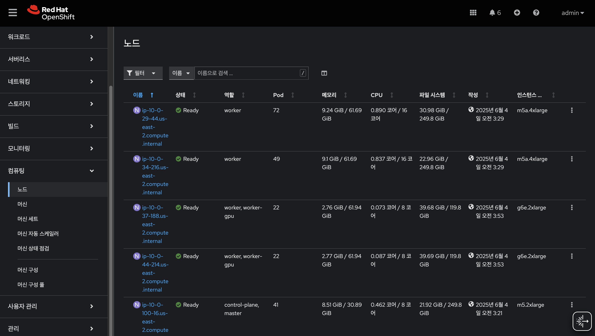
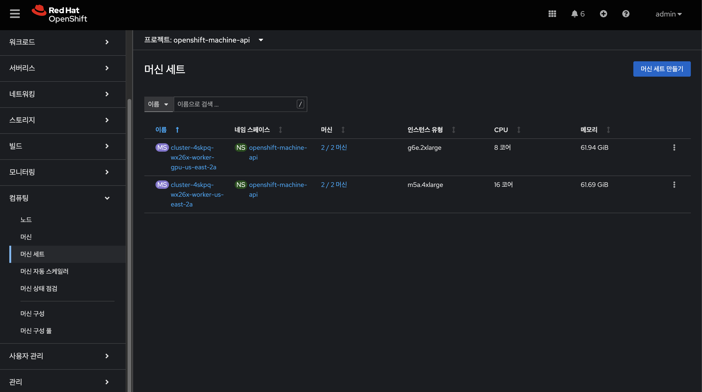
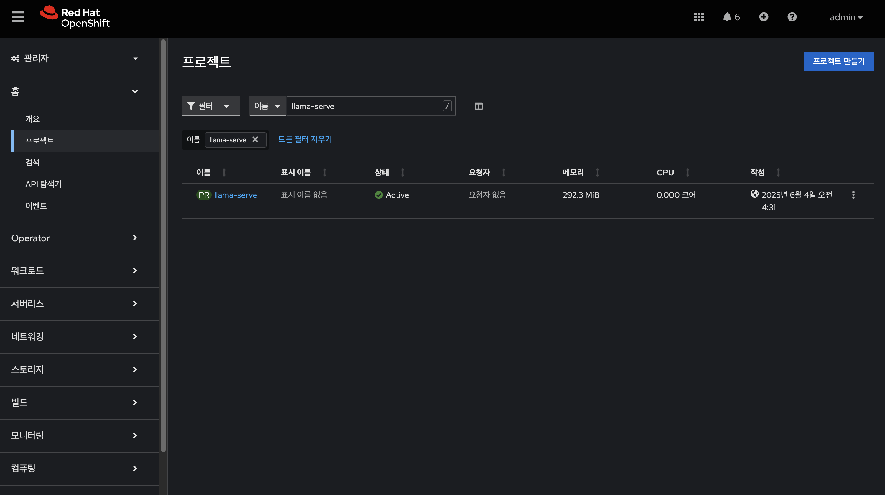
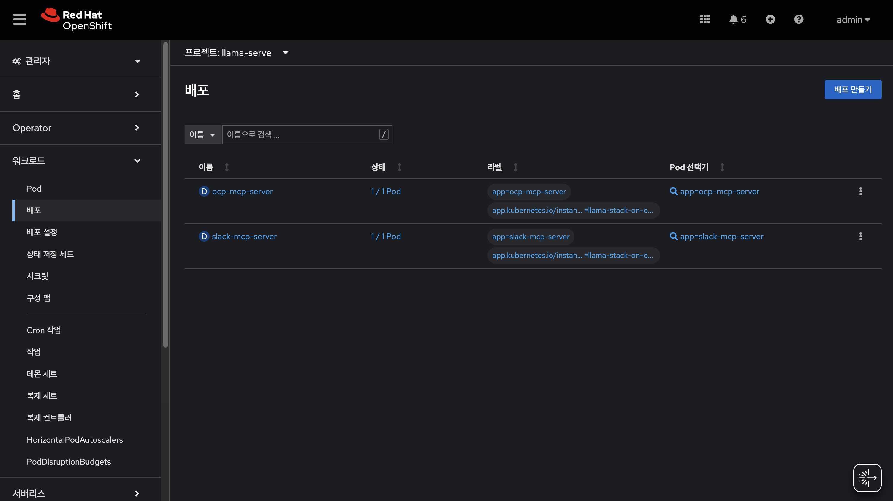
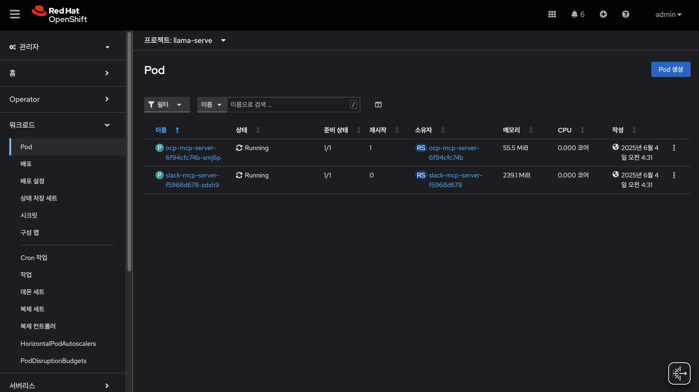
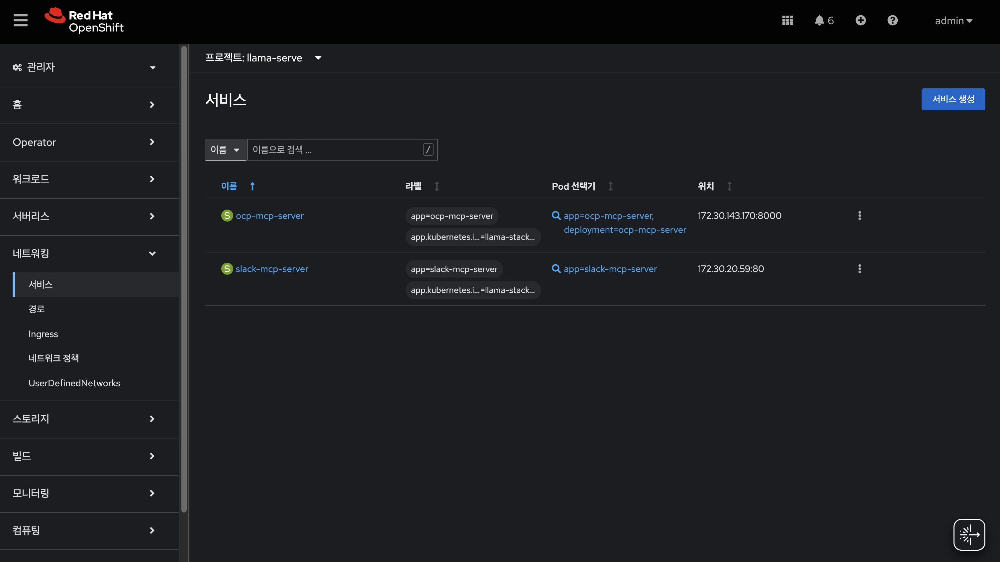

# 랩: 오픈시프트 상에 Llama 스택

1.  
2.  

 
 

## 1. 웹 콘솔에서 랩 환경 확인

### 1.1 오픈시프트 콘솔

#### 1.1.1 노드 리스트

* 마스터/워크: 3ea
* 워커: 2ea
* GPU 워커: 2ea

#### 1.1.2 머신 세트

#### 1.1.3 프로젝트 `llama-serve`

#### 1.1.4 워크로드 - 배포

#### 1.1.5 워크로드 - 포드

#### 1.1.6 네트워킹 - 서비스

 

### 1.2 RHOAI 콘솔

***작업 중***

 
 

##

 
 

------
[차례](../README.md)